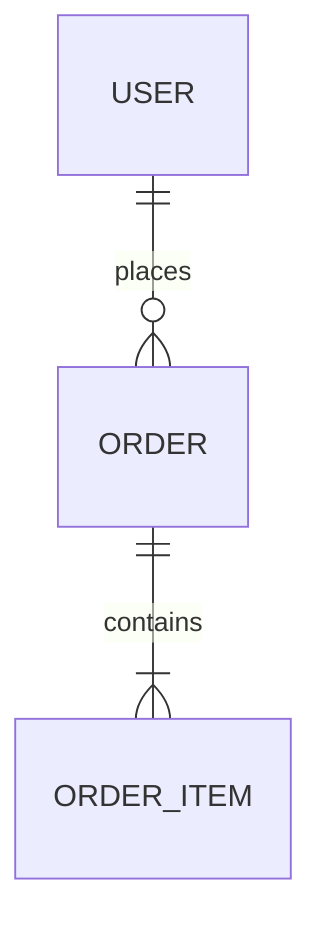

# Analysis Principles

All Unwind analysis skills follow these principles.

## 1. Completeness

Document **everything**. If there are 30 tables, document all 30. If there are 50 services, document all 50.

If a document becomes too large:
- Break into linked sub-documents (e.g., `layers/database/users-domain.md`)
- Create an index document that links to sub-documents
- Group by domain, module, or logical boundary

## 2. Machine-Readable Formats

Prefer actual definitions over markdown recreation:

**Do:**
```sql
CREATE TABLE users (
    id BIGINT PRIMARY KEY,
    email VARCHAR(255) NOT NULL UNIQUE,
    created_at TIMESTAMP DEFAULT NOW()
);
```

**Don't:**
| Column | Type | Nullable | Description |
|--------|------|----------|-------------|
| id | BIGINT | NO | Primary key |

**Do:**


**Don't:**
- Users have many Orders (1:N)
- Orders have many OrderItems (1:N)

## 3. Link to Source

Reference source files with GitHub links where possible:

**Format:** `[FileName](https://github.com/{owner}/{repo}/blob/{branch}/{path}#L{start}-L{end})`

**Example:**
```
[UserService.java](https://github.com/acme/api/blob/main/src/service/UserService.java#L45-L67)
```

For non-GitHub or local analysis, use file paths with line numbers:
```
src/service/UserService.java:45-67
```

## 4. No Commentary

**Do:**
- State what exists
- Document actual behavior
- List concrete facts

**Don't:**
- "This could be improved by..."
- "It appears that..."
- "This might be used for..."
- "Consider adding..."
- Recommendations or suggestions
- Speculation about intent

## 5. No Assumptions

Document only what is verifiable in code:

**Do:**
```
UserService.createUser() calls UserRepository.save()
```

**Don't:**
```
UserService.createUser() probably validates email first
```

If something is unclear, mark it as unknown:
```
## Unknowns
- Purpose of `legacy_flag` field in users table
```

## 6. Document Structure

When output becomes large, use this structure:

```
docs/unwind/layers/{layer}/
├── index.md           # Overview with links
├── {domain-1}.md      # Domain/module breakdown
├── {domain-2}.md
└── {domain-n}.md
```

The index.md links to all sub-documents and provides aggregate stats.

## 7. Code Over Prose

When documenting behavior, include actual code:

**Do:**
```java
// UserService.java:45-52
@Transactional
public User createUser(CreateUserRequest req) {
    User user = new User(req.email(), passwordEncoder.encode(req.password()));
    return userRepository.save(user);
}
```

**Don't:**
```
The createUser method takes a request, creates a User entity,
encodes the password, and saves it to the repository.
```

## 8. Schema Definitions

For data structures, include actual definitions:

**Database:** Include DDL or migration SQL
**API:** Include OpenAPI/GraphQL schema snippets
**Events:** Include event schema (JSON Schema, Avro, Protobuf)
**DTOs:** Include actual class/type definitions

## 9. Rebuild Categorization

The target audience for Unwind documentation is an AI agent that will rebuild the system. Tag each documented item for rebuild priority:

| Tag | Meaning | Examples |
|-----|---------|----------|
| **MUST** | Essential for comparable functionality - without this, the rebuild fails | Core calculation formulas, entity relationships, business validation rules, external API contracts |
| **SHOULD** | Valuable patterns that inform quality but could be reimplemented differently | API endpoint structure, caching strategies, error handling patterns |
| **DON'T** | Implementation details tied to current tech stack - omit from rebuild | ORM-specific syntax, CSS framework classes, build tool configuration |

**Example tagging:**
```markdown
### Rate Calculation [MUST]
```typescript
// snapshot-operations.ts:186
cost = periods[rate.interval] * rate.rate * fteBasis * allocation * holidayPercentage
```

### Drizzle ORM Query Pattern [DON'T]
```typescript
// Tech-specific - omit from rebuild docs
db.select().from(users).where(eq(users.org, orgId))
```
```

## 10. Exact Counts Required

Never use approximations. Vague counts prevent verification and suggest incomplete analysis.

**Don't:**
```markdown
The system has 30+ tables including users, orders, products...
```

**Do:**
```markdown
The system has 42 tables:
1. users
2. orders
3. products
[... all 42 listed]
```

**Why this matters:** An AI rebuild agent cannot verify completeness against "30+" but can verify against "42".

## 11. Complex Field Schemas

For JSONB, JSON, or any complex/nested field types, document the internal structure:

**Process:**
1. Search for TypeScript interfaces or type definitions
2. Search for Zod/Yup validation schemas that define the structure
3. Examine actual usage in code to infer structure
4. If structure is implicit, document from usage patterns

**Example:**
```markdown
### snapshotCalculations.calculationData [MUST]

**Type:** JSONB

**Structure:**
```typescript
{
  periodIntervals: number;    // From periods[rate.interval]
  intervalType: string;       // 'hour' | 'day' | 'week' | 'month'
  intervalRate: number;       // Rate value used
  rateSource: string;         // 'specific' | 'supplier-default' | 'missing'
  fteBasis: number;           // 0-2 range
  allocation: number;         // 0-100 percentage
  total: number;              // Calculated cost
  capexPercentage: number;    // 0-100
  totalCapex: number;         // total * capexPercentage / 100
  totalOpex: number;          // total - totalCapex
}
```

**Source:** Inferred from `snapshot-operations.ts:180-195`
```

## 12. Hardcoded Constants

Document all magic numbers and hardcoded values that affect business logic:

**Example:**
```markdown
### Constants [MUST]

| Constant | Value | Location | Usage |
|----------|-------|----------|-------|
| hoursPerDay | 8 | builder.ts:185 | Hours calculation assumes 8-hour workday |
| daysInYear | 365 | builder.ts:208 | Yearly rate proration |
| weekDivisor | 5 | builder.ts:201 | Weeks = Math.ceil(workingDays / 5) |
```

## 13. Edge Cases and Conditional Logic

Document where behavior varies based on conditions:

**Example:**
```markdown
### Rate Interval Edge Cases [MUST]

| Interval | Formula | Note |
|----------|---------|------|
| hours | workingDays * 8 * rate * fte * allocation | Uses hoursPerDay constant |
| days | workingDays * rate * fte * allocation | Standard calculation |
| weeks | Math.ceil(workingDays/5) * rate * fte * allocation | Rounds up partial weeks |
| months | rate * fte * allocation | **NO period multiplier** |
| years | (workingDays/365) * rate * fte * allocation | Prorates by working days |

**Source:** `builder.ts:193-215`
```
