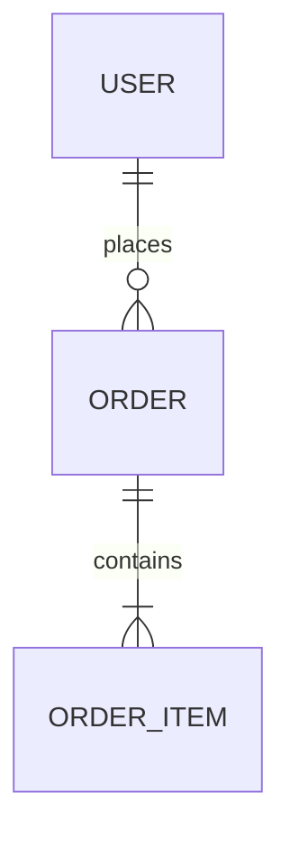

# Analysis Principles

All Unwind analysis skills follow these principles.

## 1. Completeness

Document **everything**. If there are 30 tables, document all 30. If there are 50 services, document all 50.

If a document becomes too large:
- Break into linked sub-documents (e.g., `layers/database/users-domain.md`)
- Create an index document that links to sub-documents
- Group by domain, module, or logical boundary

## 2. Machine-Readable Formats

Prefer actual definitions over markdown recreation:

**Do:**
```sql
CREATE TABLE users (
    id BIGINT PRIMARY KEY,
    email VARCHAR(255) NOT NULL UNIQUE,
    created_at TIMESTAMP DEFAULT NOW()
);
```

**Don't:**
| Column | Type | Nullable | Description |
|--------|------|----------|-------------|
| id | BIGINT | NO | Primary key |

**Do:**


**Don't:**
- Users have many Orders (1:N)
- Orders have many OrderItems (1:N)

## 3. Link to Source

Reference source files with GitHub links where possible:

**Format:** `[FileName](https://github.com/{owner}/{repo}/blob/{branch}/{path}#L{start}-L{end})`

**Example:**
```
[UserService.java](https://github.com/acme/api/blob/main/src/service/UserService.java#L45-L67)
```

For non-GitHub or local analysis, use file paths with line numbers:
```
src/service/UserService.java:45-67
```

## 4. No Commentary

**Do:**
- State what exists
- Document actual behavior
- List concrete facts

**Don't:**
- "This could be improved by..."
- "It appears that..."
- "This might be used for..."
- "Consider adding..."
- Recommendations or suggestions
- Speculation about intent

## 5. No Assumptions

Document only what is verifiable in code:

**Do:**
```
UserService.createUser() calls UserRepository.save()
```

**Don't:**
```
UserService.createUser() probably validates email first
```

If something is unclear, mark it as unknown:
```
## Unknowns
- Purpose of `legacy_flag` field in users table
```

## 6. Document Structure

When output becomes large, use this structure:

```
docs/unwind/layers/{layer}/
├── index.md           # Overview with links
├── {domain-1}.md      # Domain/module breakdown
├── {domain-2}.md
└── {domain-n}.md
```

The index.md links to all sub-documents and provides aggregate stats.

## 7. Code Over Prose

When documenting behavior, include actual code:

**Do:**
```java
// UserService.java:45-52
@Transactional
public User createUser(CreateUserRequest req) {
    User user = new User(req.email(), passwordEncoder.encode(req.password()));
    return userRepository.save(user);
}
```

**Don't:**
```
The createUser method takes a request, creates a User entity,
encodes the password, and saves it to the repository.
```

## 8. Schema Definitions

For data structures, include actual definitions:

**Database:** Include DDL or migration SQL
**API:** Include OpenAPI/GraphQL schema snippets
**Events:** Include event schema (JSON Schema, Avro, Protobuf)
**DTOs:** Include actual class/type definitions
