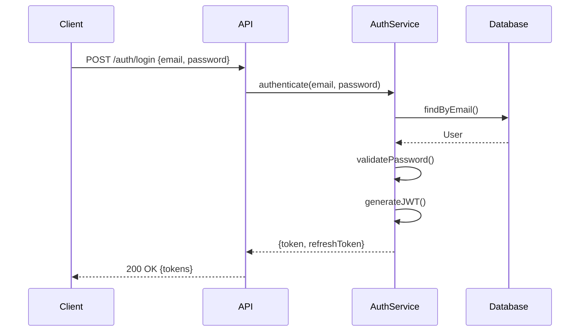

# Analyzing API Layer

## Overview

Analysis of API endpoints, request/response contracts, authentication mechanisms, and client-facing interfaces. Covers REST, GraphQL, and other API styles.

**Output:** `docs/unwind/layers/api.md`
**Depends on:** Service layer analysis

## Focus Areas

### 1. Endpoint Inventory

**REST Endpoints:**
- HTTP methods and paths
- Request/response formats
- Status codes

**GraphQL:**
- Queries and mutations
- Schema types
- Resolvers

**Other APIs:**
- gRPC services
- WebSocket endpoints
- Server-Sent Events

### 2. Request/Response Contracts

**Input Validation:**
- Required fields
- Format validation
- Business validation

**Response Formats:**
- Success responses
- Error responses
- Pagination

### 3. Authentication & Authorization

**Authentication Mechanisms:**
- JWT tokens
- OAuth 2.0 / OIDC
- API keys
- Session-based

**Authorization:**
- Role-based access
- Permission checks
- Resource-level security

### 4. API Documentation

**Specifications:**
- OpenAPI/Swagger
- GraphQL schema
- Postman collections

**Versioning:**
- URL versioning
- Header versioning
- No versioning

### 5. Rate Limiting & Security

**Rate Limiting:**
- Limits per endpoint
- Limit headers

**Security Headers:**
- CORS configuration
- CSP, HSTS, etc.

## The Process

### Step 1: Locate API Artifacts

Search for:
```
# Controllers/Routes
**/controller/**/*
**/controllers/**/*
**/api/**/*
**/routes/**/*
**/rest/**/*

# GraphQL
**/graphql/**/*
**/resolver/**/*
**/*.graphql

# Documentation
**/swagger/**/*
**/openapi/**/*
openapi.yaml, swagger.json

# Security
**/security/**/*
**/auth/**/*
**/filter/**/*
```

### Step 2: Catalog Endpoints

For REST:
1. Find all controller classes
2. Extract route annotations (@GetMapping, @router.get, etc.)
3. Document request/response types
4. Note authentication requirements

For GraphQL:
1. Find schema definitions
2. Document queries and mutations
3. Map resolvers to services

### Step 3: Analyze Security

1. Find authentication filters/middleware
2. Document auth flow
3. Map authorization rules to endpoints
4. Note security configurations

### Step 4: Extract Contracts

1. Find OpenAPI/Swagger specs if present
2. Document request/response schemas
3. Note validation rules
4. Map error codes

## Output Format

```markdown
# API Layer Analysis

> **Analyzed by:** unwind:analyzing-api-layer
> **Generated:** [ISO timestamp]
> **Confidence:** High | Medium | Low

## Summary

[2-3 sentences: API style, authentication method, key characteristics]

## API Overview

| Aspect | Details |
|--------|---------|
| Style | REST / GraphQL / gRPC |
| Base URL | /api/v1 |
| Auth | JWT Bearer Token |
| Documentation | OpenAPI 3.0 |
| Versioning | URL path (/v1/) |

## Endpoint Inventory

### Summary

| Category | Count | Auth Required |
|----------|-------|---------------|
| User Management | 8 | Yes |
| Orders | 12 | Yes |
| Products | 6 | Partial |
| Public | 3 | No |

### User Endpoints

| Method | Path | Handler | Auth | Description |
|--------|------|---------|------|-------------|
| POST | /users | UserController.create | No | Registration |
| GET | /users/me | UserController.getCurrentUser | Yes | Get current user |
| PUT | /users/me | UserController.update | Yes | Update profile |
| DELETE | /users/me | UserController.delete | Yes | Delete account |

### Order Endpoints

| Method | Path | Handler | Auth | Description |
|--------|------|---------|------|-------------|
| POST | /orders | OrderController.create | Yes | Place order |
| GET | /orders | OrderController.list | Yes | List user's orders |
| GET | /orders/{id} | OrderController.get | Yes | Get order details |

[Continue for each category...]

## Request/Response Examples

### Create User

**Request:**
```http
POST /api/v1/users
Content-Type: application/json

{
  "email": "user@example.com",
  "password": "securePassword123",
  "name": "John Doe"
}
```

**Success Response:**
```http
HTTP/1.1 201 Created
Content-Type: application/json

{
  "id": 123,
  "email": "user@example.com",
  "name": "John Doe",
  "createdAt": "2024-01-15T10:30:00Z"
}
```

**Error Response:**
```http
HTTP/1.1 400 Bad Request
Content-Type: application/json

{
  "error": "VALIDATION_ERROR",
  "message": "Email already exists",
  "details": [
    { "field": "email", "message": "Must be unique" }
  ]
}
```

## Authentication & Authorization

### Authentication Flow



### JWT Structure

```json
{
  "header": {
    "alg": "RS256",
    "typ": "JWT"
  },
  "payload": {
    "sub": "123",
    "email": "user@example.com",
    "roles": ["USER"],
    "exp": 1705312200
  }
}
```

### Authorization Rules

| Endpoint Pattern | Required Role | Additional Checks |
|------------------|---------------|-------------------|
| /admin/** | ADMIN | - |
| /users/me | USER | - |
| /orders/{id} | USER | Owner check |
| /products | - | Public |

### Security Configuration

```java
// SecurityConfig.java:25
@EnableWebSecurity
public class SecurityConfig {
    @Bean
    public SecurityFilterChain filterChain(HttpSecurity http) {
        http
            .csrf().disable()
            .sessionManagement().sessionCreationPolicy(STATELESS)
            .authorizeHttpRequests()
                .requestMatchers("/api/v1/auth/**").permitAll()
                .requestMatchers("/api/v1/admin/**").hasRole("ADMIN")
                .anyRequest().authenticated();
    }
}
```

## Error Handling

### Error Response Format

```json
{
  "error": "ERROR_CODE",
  "message": "Human-readable message",
  "details": [],
  "traceId": "abc-123"
}
```

### Error Codes

| Code | HTTP Status | Description |
|------|-------------|-------------|
| VALIDATION_ERROR | 400 | Input validation failed |
| UNAUTHORIZED | 401 | Authentication required |
| FORBIDDEN | 403 | Insufficient permissions |
| NOT_FOUND | 404 | Resource not found |
| INTERNAL_ERROR | 500 | Server error |

## API Documentation

### OpenAPI Spec Location
- `/docs/openapi.yaml`
- Swagger UI: `/swagger-ui.html`

### Documentation Coverage

| Category | Documented | Missing |
|----------|------------|---------|
| User | 100% | - |
| Orders | 80% | 2 endpoints |
| Admin | 50% | 4 endpoints |

## Rate Limiting

| Endpoint | Limit | Window |
|----------|-------|--------|
| /auth/login | 5 | 1 minute |
| /api/** | 100 | 1 minute |
| /api/search | 20 | 1 minute |

## CORS Configuration

```java
// CorsConfig.java
allowedOrigins: ["https://app.example.com"]
allowedMethods: ["GET", "POST", "PUT", "DELETE"]
allowedHeaders: ["Authorization", "Content-Type"]
```

## Cross-Cutting Touchpoints

@cross-cutting:authentication
- JWT filter on all /api/** routes
- Token refresh endpoint at /auth/refresh
- Token blacklist on logout

@cross-cutting:validation
- Bean Validation on request DTOs
- Custom validators for business rules
- Consistent error response format

@cross-cutting:logging
- Request/response logging
- Correlation ID propagation
- Sensitive data masking

@cross-cutting:error-handling
- Global @ControllerAdvice
- Exception to error code mapping
- Stack traces excluded in prod

## Patterns Observed

### Pattern: Resource-Based URLs
- `/users`, `/orders`, `/products`
- Nested resources: `/users/{id}/orders`

### Pattern: Consistent Response Envelope
- All responses wrapped in standard format

### Anti-Pattern: Mixed Versioning
- Some endpoints use /v1/, others don't

## Unknowns and Questions

- [ ] `/api/legacy/**` - still in use?
- [ ] Rate limiting not documented

## Recommendations

1. **Complete API documentation** - 8 undocumented endpoints
2. **Standardize versioning** - Mix of versioned/unversioned URLs
3. **Add rate limit headers** - X-RateLimit-* headers missing
4. **Document error codes** - No central error code reference
```

## Refresh Mode

If previous analysis exists:
1. Load existing API layer doc
2. Detect changes (new endpoints, changed contracts)
3. Add `## Changes Since Last Review`
4. Flag new endpoints, deprecated endpoints, security changes
