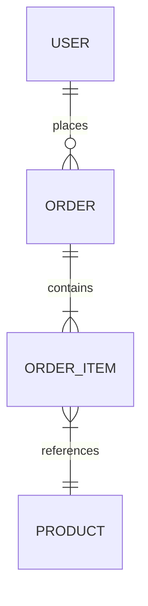

# Analyzing Database Layer

## Overview

Deep analysis of database schema, migrations, ORM configuration, and data access patterns. Produces comprehensive documentation of the data layer.

**Output:** `docs/unwind/layers/database.md`

## Focus Areas

### 1. Schema Analysis

**Tables and Relationships:**
- Table names and purposes
- Primary keys (natural vs surrogate)
- Foreign key relationships
- Indexes (performance, unique constraints)
- Naming conventions

**Column Analysis:**
- Data types and constraints
- Nullable vs required fields
- Default values
- Computed columns

### 2. Migration History

**Migration Files:**
- Flyway (`db/migration/V*.sql`)
- Liquibase (`changelog/*.xml`)
- Alembic (`alembic/versions/*.py`)
- Prisma (`prisma/migrations/`)
- Rails (`db/migrate/*.rb`)

**Analysis:**
- Schema evolution over time
- Breaking changes
- Data migrations vs schema migrations
- Rollback capability

### 3. ORM Configuration

**Entity Mapping:**
- Entity classes and their table mappings
- Relationship mappings (OneToMany, ManyToOne, etc.)
- Lazy vs eager loading configuration
- Cascade settings

**Query Patterns:**
- Repository/DAO implementations
- Custom queries (JPQL, HQL, raw SQL)
- Query methods (Spring Data style)
- N+1 query risks

### 4. Connection and Pooling

- Connection pool configuration
- Multiple datasource setup
- Read replicas
- Transaction isolation levels

### 5. Database-Specific Features

- Stored procedures
- Triggers
- Views
- Database-specific types (JSON, arrays, etc.)

## The Process

### Step 1: Locate Database Artifacts

Search for:
```
# Migration files
**/migration*/**/*.sql
**/changelog/**/*.xml
**/alembic/versions/*.py

# ORM configuration
**/entity/**/*.java
**/model/**/*.py
**/entities/**/*.ts

# Repository layer
**/repository/**/*
**/dao/**/*

# Configuration
application.yml, application.properties
database.yml, config/database.yml
.env, config.py
```

### Step 2: Analyze Schema

1. Read migration files chronologically
2. Build current schema state
3. Document tables with columns and types
4. Map relationships (FK constraints)
5. Note indexes and constraints

### Step 3: Analyze Data Access

1. Find repository/DAO classes
2. Document CRUD operations
3. Identify custom queries
4. Note transaction boundaries
5. Flag N+1 query risks

### Step 4: Document Patterns

Identify and document:
- Repository pattern usage
- Query builder patterns
- Soft delete patterns
- Audit trail patterns
- Multi-tenancy patterns

## Output Format

```markdown
# Database Layer Analysis

> **Analyzed by:** unwind:analyzing-database-layer
> **Generated:** [ISO timestamp]
> **Confidence:** High | Medium | Low

## Summary

[2-3 sentences: database type, ORM, key characteristics]

## Technology Stack

| Component | Technology |
|-----------|------------|
| Database | PostgreSQL 14 |
| ORM | Hibernate 6.x |
| Migrations | Flyway |
| Connection Pool | HikariCP |

## Schema Overview

### Tables

| Table | Purpose | Rows (est.) | Key Relationships |
|-------|---------|-------------|-------------------|
| users | User accounts | ~10k | Has many orders |
| orders | Purchase orders | ~100k | Belongs to user |

### Entity-Relationship Diagram



## Table Details

### users

| Column | Type | Nullable | Description |
|--------|------|----------|-------------|
| id | BIGINT | NO | Primary key |
| email | VARCHAR(255) | NO | Unique email |
| created_at | TIMESTAMP | NO | Creation time |

**Indexes:**
- `idx_users_email` (UNIQUE) on `email`

**Relationships:**
- One-to-Many with `orders`

[Repeat for key tables...]

## Migration Analysis

### Timeline

| Version | Date | Description | Impact |
|---------|------|-------------|--------|
| V1 | 2023-01-15 | Initial schema | - |
| V2 | 2023-03-20 | Add orders table | New table |
| V3 | 2024-01-10 | Add soft delete | Column add |

### Notable Migrations

**V3: Soft Delete Implementation**
- Added `deleted_at` to users, orders
- Impact: All queries need to filter deleted

## Data Access Patterns

### Repositories

| Repository | Entity | Custom Queries |
|------------|--------|----------------|
| UserRepository | User | findByEmail, findActiveUsers |
| OrderRepository | Order | findByUserAndStatus |

### Query Analysis

**Custom Queries:**
```java
// UserRepository.java:45
@Query("SELECT u FROM User u WHERE u.status = 'ACTIVE'")
List<User> findActiveUsers();
```

**N+1 Risks:**
- `OrderRepository.findAll()` - orders loaded without items
- Recommendation: Add `@EntityGraph` or fetch join

## Cross-Cutting Touchpoints

@cross-cutting:audit
- `created_at`, `updated_at` on all tables
- `created_by`, `updated_by` on some tables

@cross-cutting:soft-delete
- `deleted_at` column pattern
- Global filter in ORM config

## Performance Considerations

### Indexes
- [List important indexes and their purpose]

### Missing Indexes
- [Potential index recommendations]

### Query Optimization
- [Slow query patterns identified]

## Unknowns and Questions

- [ ] Purpose of `legacy_data` table unclear
- [ ] Orphaned table `temp_migration` - safe to remove?

## Recommendations

1. **Add index on orders.user_id** - FK without index
2. **Review N+1 in OrderService.getAll()** - Consider fetch join
3. **Document legacy tables** - Several undocumented tables
```

## Refresh Mode

If `docs/unwind/layers/database.md` exists:

1. Load previous analysis
2. Detect schema changes (new tables, columns, migrations)
3. Add `## Changes Since Last Review` section
4. Highlight new findings vs confirmed findings
