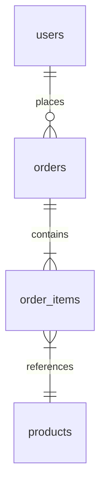

# Analyzing Database Layer

**Output:** `docs/unwind/layers/database/` (folder with index.md + section files)

**Principles:** See `analysis-principles.md` - completeness, machine-readable, link to source, no commentary, incremental writes.

## Output Structure

```
docs/unwind/layers/database/
├── index.md           # Overview, table count, links to sections
├── schema.md          # Current DDL for all tables
├── repositories.md    # Data access patterns, queries
└── jsonb-schemas.md   # Complex field type definitions (if any JSONB/JSON columns)
```

For large codebases (20+ tables), split by domain:
```
docs/unwind/layers/database/
├── index.md
├── users-domain.md    # users, user_settings, user_roles tables
├── orders-domain.md   # orders, order_items, shipments tables
└── ...
```

## Process (Incremental Writes)

**Step 1: Setup**
```bash
mkdir -p docs/unwind/layers/database/
```
Write initial `index.md`:
```markdown
# Database Layer

## Sections
- [Schema](schema.md) - _pending_
- [Repositories](repositories.md) - _pending_
- [JSONB Schemas](jsonb-schemas.md) - _pending_

## Summary
_Analysis in progress..._
```

**Step 2: Analyze and write schema.md**
1. Find migration files (Flyway, Liquibase, Alembic, Prisma, Drizzle)
2. Extract CURRENT schema state (not migration history)
3. Document ALL tables, columns, indexes, constraints
4. Write `schema.md` immediately
5. Update `index.md` link to remove "_pending_"

**Step 3: Analyze and write repositories.md**
1. Find repository/DAO classes
2. List ALL with GitHub links and method signatures
3. Write `repositories.md` immediately
4. Update `index.md`

**Step 4: Analyze and write jsonb-schemas.md** (if applicable)
1. Find JSONB/JSON columns
2. Extract TypeScript interfaces or Zod schemas
3. Write `jsonb-schemas.md` immediately
4. Update `index.md`

**Step 5: Finalize index.md**
Update with final counts and summary

## Output Format

### index.md

```markdown
# Database Layer

## Sections
- [Schema](schema.md) - 12 tables, 4 indexes
- [Repositories](repositories.md) - 8 repository classes
- [JSONB Schemas](jsonb-schemas.md) - 3 complex field types

## Migrations

**Location:** `src/db/migrations/`

Current schema state (result of all migrations) is documented in [schema.md](schema.md).

## Entity Relationships



## Summary
- **Tables:** 12
- **Repositories:** 8
- **JSONB columns:** 3

## Unknowns
- [List anything unclear]
```

### schema.md

```markdown
# Database Schema

## Tables (12 total)

### users [MUST]

```sql
CREATE TABLE users (
    id BIGINT PRIMARY KEY AUTO_INCREMENT,
    email VARCHAR(255) NOT NULL UNIQUE,
    password_hash VARCHAR(255) NOT NULL,
    created_at TIMESTAMP DEFAULT CURRENT_TIMESTAMP
);

CREATE INDEX idx_users_email ON users(email);
```

| Column | Type | Nullable | Default | Constraints |
|--------|------|----------|---------|-------------|
| id | BIGINT | NO | auto | PRIMARY KEY |
| email | VARCHAR(255) | NO | - | UNIQUE |

[Continue for ALL tables...]
```

### repositories.md

```markdown
# Repositories

## UserRepository

[UserRepository.java](https://github.com/owner/repo/blob/main/src/repository/UserRepository.java)

```java
public interface UserRepository extends JpaRepository<User, Long> {
    Optional<User> findByEmail(String email);

    @Query("SELECT u FROM User u WHERE u.status = :status")
    List<User> findByStatus(@Param("status") UserStatus status);
}
```

[Continue for ALL repositories...]
```

## Additional Requirements

### Field-Level Documentation [MUST]

For EVERY table, document ALL of the following:
- Column name and database type (VARCHAR, INTEGER, JSONB, etc.)
- NOT NULL constraints
- DEFAULT values
- UNIQUE constraints
- Foreign key relationships with ON DELETE behavior (CASCADE, SET NULL, RESTRICT)

**Example:**
```markdown
### users table [MUST]

| Column | Type | Nullable | Default | Constraints |
|--------|------|----------|---------|-------------|
| id | SERIAL | NO | auto | PRIMARY KEY |
| email | VARCHAR(255) | NO | - | UNIQUE |
| organisation | INTEGER | NO | - | FK → organisation.id ON DELETE CASCADE |
| created_at | TIMESTAMP | NO | NOW() | - |
```

### JSONB Schema Extraction [MUST]

For every JSONB/JSON column:
1. Search for TypeScript interfaces that type this field
2. Search for Zod schemas that validate it
3. If no explicit type, infer from usage in code
4. Document the complete nested structure

**Example:**
```markdown
### calculationData (JSONB) [MUST]

**Source:** Inferred from `snapshot-operations.ts:180-195`

```typescript
{
  periodIntervals: number;
  intervalType: 'hour' | 'day' | 'week' | 'month';
  total: number;
  capexPercentage: number;  // 0-100
  totalCapex: number;
  totalOpex: number;
}
```
```

### Index Documentation [SHOULD]

Document ALL indexes with:
- Index name
- Columns covered
- Type (btree, gin, partial)
- Rationale (if apparent from naming or usage)

## Mandatory Tagging

**Every table, function, and schema must have a [MUST], [SHOULD], or [DON'T] tag in its heading.**

Default categorizations for database layer:
- **[MUST]**: All tables, core repository functions, JSONB schemas
- **[SHOULD]**: Audit/logging tables, test utilities, performance indexes
- **[DON'T]**: ORM-specific query patterns, migration-specific syntax

Example:
```markdown
### users [MUST]
### audit_logs [SHOULD]
### FindUserByEmail [MUST]
### GetTestDBPath [SHOULD]
```

See `analysis-principles.md` section 9 for full tagging rules.

## Refresh Mode

If `docs/unwind/layers/database/` exists, compare current state and add `## Changes Since Last Review` section to `index.md`.
