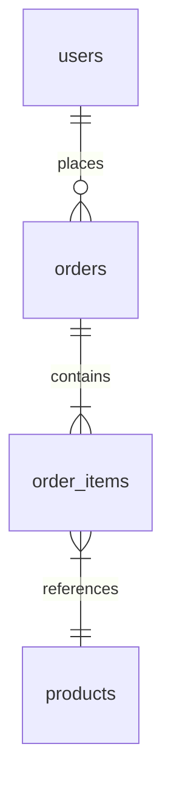

# Analyzing Database Layer

**Output:** `docs/unwind/layers/database.md` (or `database/` directory if large)

**Principles:** See `analysis-principles.md` - completeness, machine-readable, link to source, no commentary.

## Process

1. **Find all database artifacts:**
   - Migration files (Flyway, Liquibase, Alembic, Prisma)
   - Entity/model classes
   - Repository/DAO classes
   - Database configuration

2. **Extract schema:**
   - Include actual DDL or migration SQL
   - Document ALL tables, columns, indexes, constraints
   - Use mermaid ERD for relationships

3. **Document repositories:**
   - List ALL repository classes with GitHub links
   - Include method signatures
   - Note custom queries (actual SQL/JPQL)

4. **If large:** Split by domain into `layers/database/{domain}.md`

## Output Format

```markdown
# Database Layer

## Schema

### Tables

[List ALL tables]

#### users

```sql
-- From: migrations/V1__create_users.sql
CREATE TABLE users (
    id BIGINT PRIMARY KEY AUTO_INCREMENT,
    email VARCHAR(255) NOT NULL UNIQUE,
    password_hash VARCHAR(255) NOT NULL,
    created_at TIMESTAMP DEFAULT CURRENT_TIMESTAMP
);

CREATE INDEX idx_users_email ON users(email);
```

### Entity Relationships



## Repositories

### UserRepository

[UserRepository.java](https://github.com/owner/repo/blob/main/src/repository/UserRepository.java)

```java
public interface UserRepository extends JpaRepository<User, Long> {
    Optional<User> findByEmail(String email);

    @Query("SELECT u FROM User u WHERE u.status = :status")
    List<User> findByStatus(@Param("status") UserStatus status);
}
```

[Continue for ALL repositories...]

## Migrations

| Version | File | Description |
|---------|------|-------------|
| V1 | V1__initial.sql | Initial schema |
| V2 | V2__add_orders.sql | Add orders table |

## Unknowns

- [List anything unclear]
```

## Additional Requirements

### Field-Level Documentation [MUST]

For EVERY table, document ALL of the following:
- Column name and database type (VARCHAR, INTEGER, JSONB, etc.)
- NOT NULL constraints
- DEFAULT values
- UNIQUE constraints
- Foreign key relationships with ON DELETE behavior (CASCADE, SET NULL, RESTRICT)

**Example:**
```markdown
### users table [MUST]

| Column | Type | Nullable | Default | Constraints |
|--------|------|----------|---------|-------------|
| id | SERIAL | NO | auto | PRIMARY KEY |
| email | VARCHAR(255) | NO | - | UNIQUE |
| organisation | INTEGER | NO | - | FK → organisation.id ON DELETE CASCADE |
| created_at | TIMESTAMP | NO | NOW() | - |
```

### JSONB Schema Extraction [MUST]

For every JSONB/JSON column:
1. Search for TypeScript interfaces that type this field
2. Search for Zod schemas that validate it
3. If no explicit type, infer from usage in code
4. Document the complete nested structure

**Example:**
```markdown
### calculationData (JSONB) [MUST]

**Source:** Inferred from `snapshot-operations.ts:180-195`

```typescript
{
  periodIntervals: number;
  intervalType: 'hour' | 'day' | 'week' | 'month';
  total: number;
  capexPercentage: number;  // 0-100
  totalCapex: number;
  totalOpex: number;
}
```
```

### Index Documentation [SHOULD]

Document ALL indexes with:
- Index name
- Columns covered
- Type (btree, gin, partial)
- Rationale (if apparent from naming or usage)

## Refresh Mode

If `database.md` exists, compare and add `## Changes Since Last Review` section.
