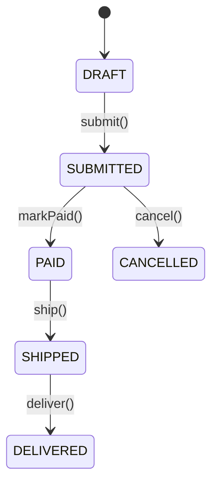

# Analyzing Domain Model

**Output:** `docs/unwind/layers/domain-model.md` (or `domain-model/` directory if large)

**Principles:** See `analysis-principles.md` - completeness, machine-readable, link to source, no commentary.

## Process

1. **Find all domain artifacts:**
   - Entity classes
   - Value objects
   - Enums
   - Domain events

2. **Document ALL entities:**
   - Include actual class definitions
   - Show field types and annotations
   - Link to source files

3. **Extract business rules:**
   - Validation logic (actual code)
   - State transitions (actual code)
   - Invariants (actual code)

4. **If large:** Split by aggregate/domain into `layers/domain-model/{aggregate}.md`

## Output Format

```markdown
# Domain Model

## Entities

### User

[User.java](https://github.com/owner/repo/blob/main/src/domain/User.java)

```java
@Entity
@Table(name = "users")
public class User {
    @Id
    @GeneratedValue(strategy = GenerationType.IDENTITY)
    private Long id;

    @Column(nullable = false, unique = true)
    private String email;

    @Enumerated(EnumType.STRING)
    private UserStatus status = UserStatus.ACTIVE;

    @OneToMany(mappedBy = "user", cascade = CascadeType.ALL)
    private List<Order> orders = new ArrayList<>();

    public void suspend() {
        if (this.status == UserStatus.DELETED) {
            throw new IllegalStateException("Cannot suspend deleted user");
        }
        this.status = UserStatus.SUSPENDED;
    }
}
```

[Continue for ALL entities...]

## Value Objects

### Money

[Money.java](https://github.com/owner/repo/blob/main/src/domain/Money.java)

```java
@Embeddable
public class Money {
    private BigDecimal amount;

    @Enumerated(EnumType.STRING)
    private Currency currency;

    public Money add(Money other) {
        if (!this.currency.equals(other.currency)) {
            throw new IllegalArgumentException("Currency mismatch");
        }
        return new Money(this.amount.add(other.amount), this.currency);
    }
}
```

## Enums

### UserStatus

```java
public enum UserStatus {
    ACTIVE, SUSPENDED, DELETED
}
```

## State Machines

### Order Status Transitions



Source: [Order.java:78-95](https://github.com/owner/repo/blob/main/src/domain/Order.java#L78-L95)

## Unknowns

- [List anything unclear]
```

## Additional Requirements

### Validation Constraint Tables [MUST]

For each validation schema, create a constraint table:

```markdown
### Position Validation [MUST]

| Field | Type | Min | Max | Required | Default | Notes |
|-------|------|-----|-----|----------|---------|-------|
| name | string | 1 | 200 | yes | - | |
| fteBasis | number | 0 | 2 | yes | 1.0 | Full-time equivalent |
| capexPerc | number | 0 | 100 | yes | 0 | Percentage |
| allocation | number | 0 | 100 | yes | 100 | Percentage |

**Source:** `src/validation/positions.ts`
```

### Enum Value Documentation [MUST]

Document ALL enum/union type values:

```markdown
### Position Type Enum [MUST]

```typescript
type PositionType = 'standard' | 'acting' | 'interim' | 'vacant'
```

| Value | Description |
|-------|-------------|
| standard | Permanent position |
| acting | Temporary assignment |
| interim | Short-term coverage |
| vacant | Unfilled position |
```

### Permission Matrix [MUST]

Document role-permission mappings:

```markdown
### Permission Matrix [MUST]

| Resource | owner | admin | manager | member |
|----------|-------|-------|---------|--------|
| Organisation | manage | read | read | read |
| Employee | manage | manage | manage | read |
| Budget | manage | manage | read | - |
| Rate | manage | manage | read | - |
```

### Self-Reference Rules [MUST]

Document any self-referential constraints:
```markdown
### Relationship Constraints [MUST]

- Position cannot report to itself: `fromPositionId !== toPositionId`
- End date must be after start date: `endDate > startDate`
```

## Refresh Mode

If `domain-model.md` exists, compare and add `## Changes Since Last Review` section.
