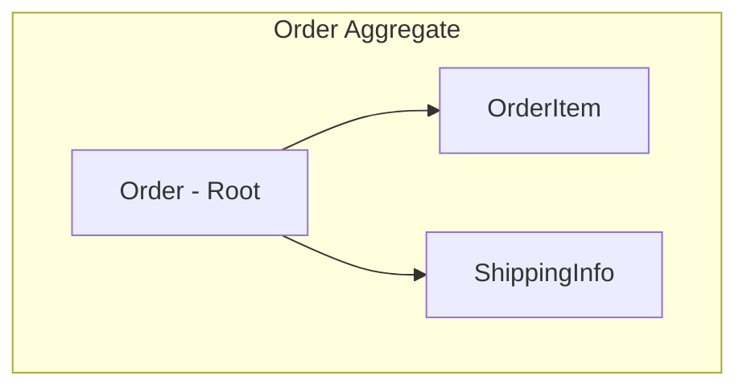
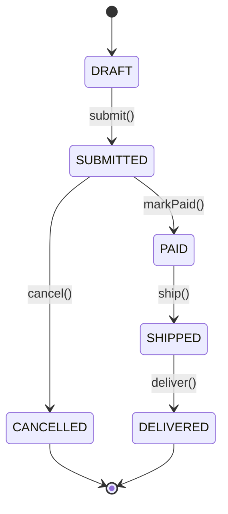

# Analyzing Domain Model

## Overview

Analysis of domain entities, value objects, aggregates, and business rules. Documents the core business concepts and their relationships.

**Output:** `docs/unwind/layers/domain-model.md`
**Depends on:** Database layer analysis (for entity-table mapping context)

## Focus Areas

### 1. Entity Identification

**Core Entities:**
- Primary business objects
- Identity and lifecycle
- Mutable state

**Entity Characteristics:**
- Unique identifier strategy
- Required vs optional fields
- State transitions
- Business invariants

### 2. Value Objects

**Immutable Values:**
- Objects defined by attributes, not identity
- Examples: Money, Address, DateRange, Email

**Patterns:**
- Embedded values vs separate tables
- Validation in constructor
- Equality by value

### 3. Aggregates (if DDD)

**Aggregate Roots:**
- Consistency boundaries
- Transaction boundaries
- Invariant enforcement

**Aggregate Design:**
- What entities belong together?
- How are boundaries enforced?
- Cross-aggregate references

### 4. Business Rules

**Invariants:**
- Rules that must always be true
- Validation logic
- State constraints

**Domain Logic:**
- Calculations
- Business decisions
- State transitions

### 5. Domain Events

**Event Definitions:**
- What happened in the domain
- Event payload structure
- Event naming conventions

## The Process

### Step 1: Locate Domain Artifacts

Search for:
```
# Entity/Model directories
**/domain/**/*
**/model/**/*
**/entity/**/*
**/entities/**/*

# Value objects
**/vo/**/*
**/valueobject/**/*

# Events
**/event/**/*
**/events/**/*
```

### Step 2: Catalog Entities

For each entity:
1. Identify the class/type
2. Map to database table (from database analysis)
3. Document fields and types
4. Note relationships
5. Find business logic methods

### Step 3: Identify Value Objects

Look for:
- Immutable classes
- Classes without ID
- `@Embeddable` (JPA)
- Frozen dataclasses (Python)
- `readonly` types (TypeScript)

### Step 4: Map Aggregates

If DDD patterns present:
1. Identify aggregate roots
2. Map aggregate boundaries
3. Document invariants
4. Note consistency rules

### Step 5: Extract Business Rules

Find business logic in:
- Entity methods
- Validation annotations/decorators
- Constructor constraints
- State machine logic

## Output Format

```markdown
# Domain Model Analysis

> **Analyzed by:** unwind:analyzing-domain-model
> **Generated:** [ISO timestamp]
> **Confidence:** High | Medium | Low

## Summary

[2-3 sentences: domain style, key concepts, patterns used]

## Domain Style

- [ ] Anemic Domain Model (logic in services)
- [x] Rich Domain Model (logic in entities)
- [ ] DDD with Aggregates
- [ ] Event Sourced

## Core Entities

### Entity Overview

| Entity | Table | Purpose | Key Relationships |
|--------|-------|---------|-------------------|
| User | users | System user | Has Orders, Profile |
| Order | orders | Purchase record | Belongs to User |
| Product | products | Catalog item | In OrderItems |

### User

**Purpose:** Represents a system user account

**Fields:**
| Field | Type | Required | Business Rule |
|-------|------|----------|---------------|
| id | Long | Yes | Auto-generated |
| email | Email | Yes | Must be unique, valid format |
| status | UserStatus | Yes | ACTIVE, SUSPENDED, DELETED |

**Relationships:**
- One-to-Many: Orders
- One-to-One: Profile

**Business Methods:**
```java
// User.java:78
public void suspend() {
    if (this.status == UserStatus.DELETED) {
        throw new IllegalStateException("Cannot suspend deleted user");
    }
    this.status = UserStatus.SUSPENDED;
}
```

**Invariants:**
- Email must be valid format
- Cannot transition from DELETED to other states

[Repeat for each entity...]

## Value Objects

### Money

**Purpose:** Represents monetary amounts with currency

**Structure:**
```java
@Embeddable
public class Money {
    private BigDecimal amount;
    private Currency currency;
}
```

**Usage:** Order.total, OrderItem.price

### Address

**Purpose:** Mailing/billing address

**Structure:**
| Field | Type |
|-------|------|
| street | String |
| city | String |
| country | Country |
| postalCode | String |

## Aggregates (if applicable)

### Order Aggregate

**Root:** Order
**Boundary:** Order, OrderItem, ShippingInfo

**Invariants:**
- Order total must equal sum of items
- Cannot add items to shipped order
- At least one item required

**Consistency Rules:**
- All OrderItems managed through Order
- No direct OrderItem repository access



## State Machines

### Order Status



## Domain Events

| Event | Trigger | Payload |
|-------|---------|---------|
| UserCreated | User registration | userId, email |
| OrderPlaced | Order submission | orderId, userId, total |
| OrderShipped | Shipping confirmed | orderId, trackingNumber |

## Business Rules Summary

| Rule | Location | Description |
|------|----------|-------------|
| Email uniqueness | User entity | Enforced at DB and domain |
| Order minimum | Order.submit() | Must have at least 1 item |
| Price immutability | OrderItem | Price locked at creation |

## Cross-Cutting Touchpoints

@cross-cutting:validation
- Bean Validation annotations throughout
- Custom validators for complex rules

@cross-cutting:audit
- BaseEntity with created/updated timestamps
- Auditable entities track user changes

## Patterns Observed

### Pattern: Entity Base Class
All entities extend `BaseEntity` with id, created, updated.

### Pattern: Status Enum
Entities use enum for status with allowed transitions.

### Anti-Pattern: Anemic Services
Some logic in services should move to entities:
- `UserService.validateEmail()` → `User.setEmail()`

## Unknowns and Questions

- [ ] Purpose of `LegacyOrder` entity unclear
- [ ] `Product.metadata` JSON field - structure undocumented

## Recommendations

1. **Move validation to entities** - Email validation in UserService should be in User
2. **Document state transitions** - Add state diagram to Order class
3. **Consider aggregate boundaries** - OrderItem accessible outside Order aggregate
```

## Refresh Mode

If previous analysis exists:
1. Load existing domain model doc
2. Detect changes (new entities, modified rules)
3. Add `## Changes Since Last Review`
4. Flag new entities, removed entities, changed relationships
