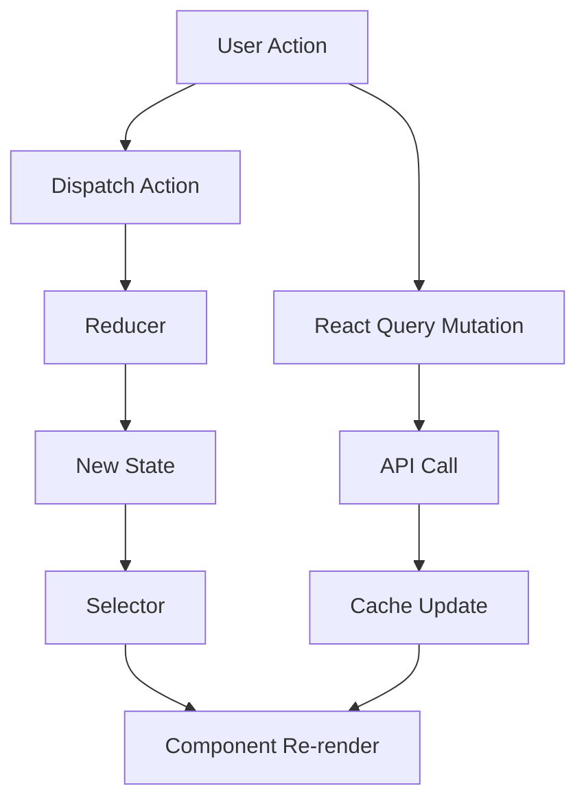

# Analyzing Frontend Layer

## Overview

Analysis of frontend/UI layer including component architecture, state management, routing, and API integration. Applies to web frontends (React, Vue, Angular, etc.) and may apply to mobile apps.

**Output:** `docs/unwind/layers/frontend.md`
**Depends on:** API layer analysis
**Optional:** Skip if no frontend detected in architecture

## Focus Areas

### 1. Component Architecture

**Framework:**
- React, Vue, Angular, Svelte, etc.
- Version and key libraries

**Component Organization:**
- Directory structure
- Component types (pages, layouts, features, shared)
- Naming conventions

### 2. State Management

**Patterns:**
- Local state (useState, ref)
- Global state (Redux, Zustand, Pinia, NgRx)
- Server state (React Query, SWR, Apollo)

**State Structure:**
- Store organization
- Selectors/computed
- Actions/mutations

### 3. Routing

**Router:**
- React Router, Vue Router, Angular Router
- Route definitions
- Guards/middleware

**Navigation Patterns:**
- Public vs protected routes
- Nested routes
- Dynamic routes

### 4. API Integration

**HTTP Client:**
- Axios, fetch, Apollo Client
- Base configuration
- Interceptors

**Data Fetching:**
- When/where data is fetched
- Loading/error states
- Caching strategy

### 5. Styling

**Approach:**
- CSS Modules, Styled Components, Tailwind
- Design system/component library
- Theming

### 6. Build & Bundle

**Build Tool:**
- Vite, Webpack, Next.js, etc.
- Configuration
- Optimization

## The Process

### Step 1: Locate Frontend Artifacts

Search for:
```
# Framework indicators
package.json (react, vue, angular, svelte)
next.config.js, nuxt.config.ts
angular.json, vue.config.js

# Components
**/components/**/*
**/pages/**/*
**/views/**/*
**/src/**/*.tsx
**/src/**/*.vue

# State
**/store/**/*
**/redux/**/*
**/state/**/*

# Routing
**/routes/**/*
**/router/**/*

# API/Services
**/api/**/*
**/services/**/*
**/hooks/**/*
```

### Step 2: Identify Framework & Stack

1. Check package.json dependencies
2. Identify core framework
3. Note key libraries (state, routing, UI)
4. Document build tool

### Step 3: Analyze Component Structure

1. Map directory structure
2. Identify component categories
3. Document key components
4. Note reusable patterns

### Step 4: Analyze State Management

1. Find state management setup
2. Document store structure
3. Map state to components
4. Note async patterns

### Step 5: Analyze API Integration

1. Find API client configuration
2. Document API hooks/services
3. Map API calls to components
4. Note error handling

## Output Format

```markdown
# Frontend Layer Analysis

> **Analyzed by:** unwind:analyzing-frontend-layer
> **Generated:** [ISO timestamp]
> **Confidence:** High | Medium | Low

## Summary

[2-3 sentences: framework, architecture pattern, key characteristics]

## Technology Stack

| Category | Technology |
|----------|------------|
| Framework | React 18 |
| Language | TypeScript 5.x |
| Build Tool | Vite |
| State | Redux Toolkit + React Query |
| Routing | React Router 6 |
| Styling | Tailwind CSS |
| UI Library | Radix UI |
| Testing | Vitest + Testing Library |

## Project Structure

```
src/
├── components/          # Shared UI components
│   ├── ui/             # Base components (Button, Input)
│   └── features/       # Feature-specific components
├── pages/              # Route pages
├── hooks/              # Custom React hooks
├── store/              # Redux store
├── api/                # API client and hooks
├── utils/              # Utility functions
├── types/              # TypeScript types
└── styles/             # Global styles
```

## Component Architecture

### Component Categories

| Category | Location | Purpose | Count |
|----------|----------|---------|-------|
| Pages | /pages | Route entry points | 15 |
| Features | /components/features | Business features | 24 |
| UI | /components/ui | Reusable primitives | 32 |
| Layouts | /components/layouts | Page layouts | 4 |

### Key Components

#### UserDashboard (Page)

**Location:** `src/pages/Dashboard/UserDashboard.tsx`

**Purpose:** Main user dashboard after login

**Structure:**
```tsx
export function UserDashboard() {
  const { user } = useAuth();
  const { data: orders } = useOrders();

  return (
    <DashboardLayout>
      <WelcomeBanner user={user} />
      <OrdersSummary orders={orders} />
      <RecentActivity />
    </DashboardLayout>
  );
}
```

**Dependencies:**
- useAuth hook
- useOrders hook (React Query)
- DashboardLayout, WelcomeBanner, OrdersSummary, RecentActivity

[Document 5-10 key components...]

### Component Patterns

#### Pattern: Container/Presentation
- Containers: Handle data fetching and state
- Presentation: Pure UI components

#### Pattern: Compound Components
- Used in: Tabs, Accordion, Menu
- Example: `<Tabs><Tabs.List>...</Tabs.List></Tabs>`

## State Management

### Store Overview

```
store/
├── index.ts            # Store configuration
├── slices/
│   ├── authSlice.ts    # Authentication state
│   ├── uiSlice.ts      # UI state (modals, toasts)
│   └── cartSlice.ts    # Shopping cart
└── api/
    └── apiSlice.ts     # RTK Query API
```

### Redux Slices

| Slice | Purpose | Key State |
|-------|---------|-----------|
| auth | Authentication | user, token, isAuthenticated |
| ui | UI state | modals, toasts, theme |
| cart | Shopping cart | items, total |

### Server State (React Query)

| Query Key | Hook | Endpoint |
|-----------|------|----------|
| ['user'] | useUser | GET /users/me |
| ['orders'] | useOrders | GET /orders |
| ['products', filters] | useProducts | GET /products |

### State Flow



## Routing

### Route Structure

```tsx
// src/router/routes.tsx
export const routes = [
  { path: '/', element: <HomePage /> },
  { path: '/login', element: <LoginPage /> },
  {
    path: '/dashboard',
    element: <ProtectedRoute><DashboardLayout /></ProtectedRoute>,
    children: [
      { index: true, element: <DashboardHome /> },
      { path: 'orders', element: <OrdersPage /> },
      { path: 'orders/:id', element: <OrderDetailPage /> },
      { path: 'settings', element: <SettingsPage /> },
    ]
  },
  { path: '/admin', element: <AdminRoute><AdminLayout /></AdminRoute> },
  { path: '*', element: <NotFoundPage /> }
];
```

### Route Categories

| Category | Path Pattern | Auth | Example |
|----------|--------------|------|---------|
| Public | / | No | Home, Login |
| Protected | /dashboard/* | User | Dashboard |
| Admin | /admin/* | Admin | Admin Panel |

### Route Guards

```tsx
// ProtectedRoute.tsx
export function ProtectedRoute({ children }) {
  const { isAuthenticated, isLoading } = useAuth();

  if (isLoading) return <LoadingSpinner />;
  if (!isAuthenticated) return <Navigate to="/login" />;

  return children;
}
```

## API Integration

### HTTP Client Setup

```typescript
// src/api/client.ts
export const apiClient = axios.create({
  baseURL: '/api/v1',
  headers: { 'Content-Type': 'application/json' }
});

apiClient.interceptors.request.use((config) => {
  const token = store.getState().auth.token;
  if (token) {
    config.headers.Authorization = `Bearer ${token}`;
  }
  return config;
});
```

### API Hooks

| Hook | Method | Endpoint | Returns |
|------|--------|----------|---------|
| useUser | GET | /users/me | User |
| useOrders | GET | /orders | Order[] |
| useCreateOrder | POST | /orders | Order |
| useProducts | GET | /products | Product[] |

### Error Handling

```tsx
// Global error boundary for API errors
function ApiErrorBoundary({ children }) {
  return (
    <QueryErrorResetBoundary>
      {({ reset }) => (
        <ErrorBoundary onReset={reset} FallbackComponent={ErrorFallback}>
          {children}
        </ErrorBoundary>
      )}
    </QueryErrorResetBoundary>
  );
}
```

## Styling

### Approach: Tailwind CSS + Component Library

**Tailwind Config:**
```javascript
// tailwind.config.js
module.exports = {
  theme: {
    extend: {
      colors: {
        primary: '#3B82F6',
        secondary: '#10B981',
      }
    }
  }
}
```

**Component Library:** Radix UI with custom styling

### Design Tokens

| Token | Value | Usage |
|-------|-------|-------|
| --primary | #3B82F6 | Buttons, links |
| --secondary | #10B981 | Success states |
| --error | #EF4444 | Error states |

## Testing

### Test Setup

| Type | Tool | Location |
|------|------|----------|
| Unit | Vitest | *.test.ts |
| Component | Testing Library | *.test.tsx |
| E2E | Playwright | /e2e |

### Test Coverage

| Category | Coverage |
|----------|----------|
| Components | 65% |
| Hooks | 80% |
| Utils | 90% |

## Build & Bundle

### Build Tool: Vite

**Configuration Highlights:**
- Code splitting by route
- Asset optimization
- Environment variables

### Bundle Analysis

| Chunk | Size | Contents |
|-------|------|----------|
| vendor | 250KB | React, Router |
| main | 150KB | App code |
| charts | 80KB | Chart library (lazy) |

## Cross-Cutting Touchpoints

@cross-cutting:authentication
- Auth state in Redux
- Token in localStorage
- ProtectedRoute HOC
- API interceptor adds token

@cross-cutting:error-handling
- Error boundaries per route
- Toast notifications for API errors
- Sentry for error tracking

@cross-cutting:logging
- Console logging in dev
- Analytics events
- Performance monitoring

## Patterns Observed

### Pattern: Feature Folders
Components organized by feature, not type.

### Pattern: Custom Hooks
Business logic extracted to hooks (useAuth, useCart).

### Pattern: Optimistic Updates
Cart mutations update UI immediately.

### Anti-Pattern: Prop Drilling
Some deep prop passing - consider context.

## Unknowns and Questions

- [ ] `/legacy` folder - still used?
- [ ] Some components lack tests

## Recommendations

1. **Add more component tests** - Coverage below target
2. **Implement error tracking** - Sentry not configured
3. **Review bundle size** - Vendor chunk growing
4. **Document component props** - Missing JSDoc
```

## Refresh Mode

If previous analysis exists:
1. Load existing frontend layer doc
2. Detect changes (new components, routes, state)
3. Add `## Changes Since Last Review`
4. Flag new pages, deprecated components, dependency updates
