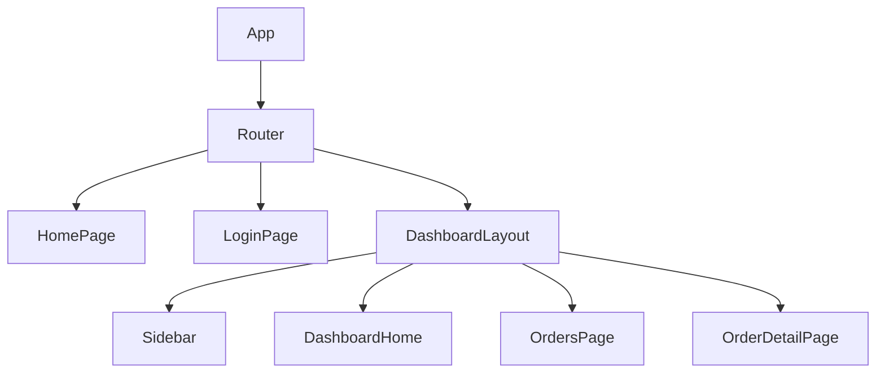

# Analyzing Frontend Layer

**Output:** `docs/unwind/layers/frontend.md` (or `frontend/` directory if large)

**Principles:** See `analysis-principles.md` - completeness, machine-readable, link to source, no commentary.

## Process

1. **Find all frontend artifacts:**
   - Component files
   - State management (store, slices, atoms)
   - Route definitions
   - API client/hooks

2. **Document ALL components:**
   - Include actual component code
   - Show props/types
   - Link to source files

3. **Document state management:**
   - Include actual store definitions
   - Show all slices/reducers/atoms

4. **If large:** Split by feature into `layers/frontend/{feature}.md`

## Output Format

```markdown
# Frontend Layer

## Technology Stack

```json
{
  "framework": "react",
  "version": "18.2.0",
  "language": "typescript",
  "stateManagement": "redux-toolkit",
  "routing": "react-router-dom",
  "styling": "tailwind",
  "build": "vite"
}
```

Source: [package.json](https://github.com/owner/repo/blob/main/package.json)

## Routes

[routes.tsx](https://github.com/owner/repo/blob/main/src/router/routes.tsx)

```tsx
export const routes: RouteObject[] = [
  { path: '/', element: <HomePage /> },
  { path: '/login', element: <LoginPage /> },
  {
    path: '/dashboard',
    element: <ProtectedRoute><DashboardLayout /></ProtectedRoute>,
    children: [
      { index: true, element: <DashboardHome /> },
      { path: 'orders', element: <OrdersPage /> },
      { path: 'orders/:id', element: <OrderDetailPage /> },
    ]
  },
  { path: '*', element: <NotFoundPage /> }
];
```

## Components

### UserDashboard

[UserDashboard.tsx](https://github.com/owner/repo/blob/main/src/pages/Dashboard/UserDashboard.tsx)

```tsx
export function UserDashboard() {
  const { user } = useAuth();
  const { data: orders, isLoading } = useOrders();

  if (isLoading) return <Spinner />;

  return (
    <div className="p-6">
      <h1>Welcome, {user.name}</h1>
      <OrdersTable orders={orders} />
    </div>
  );
}
```

[Continue for ALL components...]

## State Management

### Store Configuration

[store.ts](https://github.com/owner/repo/blob/main/src/store/store.ts)

```tsx
export const store = configureStore({
  reducer: {
    auth: authReducer,
    ui: uiReducer,
    [api.reducerPath]: api.reducer,
  },
  middleware: (getDefault) => getDefault().concat(api.middleware),
});
```

### Auth Slice

[authSlice.ts](https://github.com/owner/repo/blob/main/src/store/authSlice.ts)

```tsx
interface AuthState {
  user: User | null;
  token: string | null;
  isAuthenticated: boolean;
}

const authSlice = createSlice({
  name: 'auth',
  initialState: { user: null, token: null, isAuthenticated: false },
  reducers: {
    setCredentials: (state, action: PayloadAction<{ user: User; token: string }>) => {
      state.user = action.payload.user;
      state.token = action.payload.token;
      state.isAuthenticated = true;
    },
    logout: (state) => {
      state.user = null;
      state.token = null;
      state.isAuthenticated = false;
    },
  },
});
```

[Continue for ALL slices...]

## API Hooks

[api.ts](https://github.com/owner/repo/blob/main/src/api/api.ts)

```tsx
export const api = createApi({
  baseQuery: fetchBaseQuery({
    baseUrl: '/api/v1',
    prepareHeaders: (headers, { getState }) => {
      const token = (getState() as RootState).auth.token;
      if (token) headers.set('authorization', `Bearer ${token}`);
      return headers;
    },
  }),
  endpoints: (builder) => ({
    getUser: builder.query<User, void>({
      query: () => '/users/me',
    }),
    getOrders: builder.query<Order[], void>({
      query: () => '/orders',
    }),
    createOrder: builder.mutation<Order, CreateOrderRequest>({
      query: (body) => ({ url: '/orders', method: 'POST', body }),
    }),
  }),
});

export const { useGetUserQuery, useGetOrdersQuery, useCreateOrderMutation } = api;
```

## Component Tree



## Unknowns

- [List anything unclear]
```

## Refresh Mode

If `frontend.md` exists, compare and add `## Changes Since Last Review` section.
