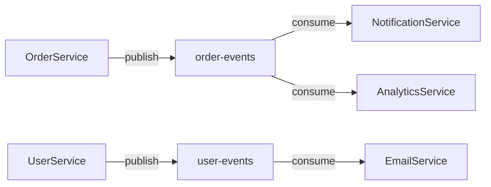

# Analyzing Messaging Layer

**Output:** `docs/unwind/layers/messaging.md` (or `messaging/` directory if large)

**Principles:** See `analysis-principles.md` - completeness, machine-readable, link to source, no commentary.

## Process

1. **Find all messaging artifacts:**
   - Event/message classes
   - Publishers/producers
   - Listeners/consumers
   - Queue/topic configuration

2. **Document ALL events:**
   - Include actual event class definitions
   - Show serialization format (JSON schema, Avro, Protobuf)
   - Link to source files

3. **Document ALL producers and consumers:**
   - Include actual implementation code
   - Show retry/error handling

4. **If large:** Split by topic/domain into `layers/messaging/{topic}.md`

## Output Format

```markdown
# Messaging Layer

## Configuration

[KafkaConfig.java](https://github.com/owner/repo/blob/main/src/config/KafkaConfig.java)

```java
@Configuration
public class KafkaConfig {
    @Value("${kafka.bootstrap-servers}")
    private String bootstrapServers;

    @Bean
    public ProducerFactory<String, Object> producerFactory() {
        Map<String, Object> config = new HashMap<>();
        config.put(ProducerConfig.BOOTSTRAP_SERVERS_CONFIG, bootstrapServers);
        config.put(ProducerConfig.KEY_SERIALIZER_CLASS_CONFIG, StringSerializer.class);
        config.put(ProducerConfig.VALUE_SERIALIZER_CLASS_CONFIG, JsonSerializer.class);
        return new DefaultKafkaProducerFactory<>(config);
    }
}
```

## Topics

| Topic | Partitions | Producers | Consumers |
|-------|------------|-----------|-----------|
| order-events | 6 | OrderService | NotificationService, AnalyticsService |
| user-events | 3 | UserService | EmailService |

## Events

### OrderCreatedEvent

[OrderCreatedEvent.java](https://github.com/owner/repo/blob/main/src/event/OrderCreatedEvent.java)

```java
public record OrderCreatedEvent(
    String eventId,
    Instant timestamp,
    Long orderId,
    Long userId,
    List<OrderItemDto> items,
    BigDecimal total
) {}
```

JSON Schema:
```json
{
  "type": "object",
  "properties": {
    "eventId": { "type": "string", "format": "uuid" },
    "timestamp": { "type": "string", "format": "date-time" },
    "orderId": { "type": "integer" },
    "userId": { "type": "integer" },
    "items": { "type": "array" },
    "total": { "type": "number" }
  },
  "required": ["eventId", "timestamp", "orderId", "userId", "total"]
}
```

[Continue for ALL events...]

## Producers

### OrderEventPublisher

[OrderEventPublisher.java](https://github.com/owner/repo/blob/main/src/messaging/OrderEventPublisher.java)

```java
@Component
@RequiredArgsConstructor
public class OrderEventPublisher {
    private final KafkaTemplate<String, Object> kafkaTemplate;

    public void publishOrderCreated(Order order) {
        OrderCreatedEvent event = new OrderCreatedEvent(
            UUID.randomUUID().toString(),
            Instant.now(),
            order.getId(),
            order.getUser().getId(),
            mapItems(order.getItems()),
            order.getTotal()
        );
        kafkaTemplate.send("order-events", order.getId().toString(), event);
    }
}
```

## Consumers

### NotificationEventConsumer

[NotificationEventConsumer.java](https://github.com/owner/repo/blob/main/src/messaging/NotificationEventConsumer.java)

```java
@Component
@RequiredArgsConstructor
public class NotificationEventConsumer {
    private final NotificationService notificationService;

    @KafkaListener(topics = "order-events", groupId = "notification-service")
    @Retryable(maxAttempts = 3)
    public void handleOrderEvent(OrderCreatedEvent event) {
        notificationService.sendOrderConfirmation(event.orderId());
    }

    @DltHandler
    public void handleDlt(OrderCreatedEvent event) {
        log.error("Failed to process event after retries: {}", event.eventId());
    }
}
```

[Continue for ALL consumers...]

## Event Flow



## Unknowns

- [List anything unclear]
```

## Refresh Mode

If `messaging.md` exists, compare and add `## Changes Since Last Review` section.
