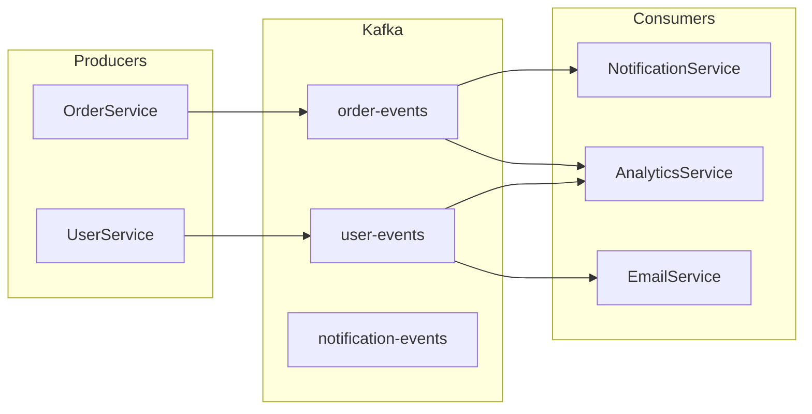

# Analyzing Messaging Layer

## Overview

Analysis of event-driven architecture, message queues, async processing patterns, and pub/sub systems. Covers both internal events and external integrations.

**Output:** `docs/unwind/layers/messaging.md`
**Depends on:** Service layer analysis

## Focus Areas

### 1. Message Brokers

**Technologies:**
- Apache Kafka
- RabbitMQ
- AWS SQS/SNS
- Azure Service Bus
- Redis Pub/Sub
- Google Pub/Sub

**Configuration:**
- Connection settings
- Topic/queue definitions
- Consumer groups

### 2. Event Patterns

**Domain Events:**
- Events representing business occurrences
- Event schemas
- Event naming conventions

**Integration Events:**
- Events for cross-service communication
- External system events

### 3. Producers and Consumers

**Publishers:**
- What triggers event publishing
- Event payload construction
- Delivery guarantees

**Subscribers:**
- Consumer implementations
- Processing logic
- Error handling

### 4. Async Workflows

**Background Jobs:**
- Job frameworks (Celery, Sidekiq, etc.)
- Scheduled tasks
- Retry policies

**Saga Patterns:**
- Distributed transactions
- Compensation logic

### 5. Reliability

**Delivery Guarantees:**
- At-least-once
- At-most-once
- Exactly-once

**Error Handling:**
- Dead letter queues
- Retry strategies
- Poison message handling

## The Process

### Step 1: Locate Messaging Artifacts

Search for:
```
# Event/Message directories
**/events/**/*
**/event/**/*
**/messaging/**/*
**/message/**/*
**/kafka/**/*
**/rabbitmq/**/*
**/queue/**/*

# Listeners/Handlers
**/listener/**/*
**/handler/**/*
**/consumer/**/*
**/subscriber/**/*

# Configuration
**/config/*kafka*
**/config/*rabbit*
**/config/*sqs*
application.yml (kafka., spring.rabbitmq.)
```

### Step 2: Identify Message Broker

1. Check dependencies (pom.xml, package.json, etc.)
2. Find configuration files
3. Document broker technology
4. Note clustering/scaling setup

### Step 3: Catalog Events

For each event:
1. Event name/type
2. Payload schema
3. Publisher(s)
4. Consumer(s)
5. Topic/queue

### Step 4: Analyze Producers

1. Find publisher classes
2. Document when events are published
3. Note transactional behavior
4. Document payload construction

### Step 5: Analyze Consumers

1. Find listener classes
2. Document processing logic
3. Note error handling
4. Document idempotency measures

## Output Format

```markdown
# Messaging Layer Analysis

> **Analyzed by:** unwind:analyzing-messaging-layer
> **Generated:** [ISO timestamp]
> **Confidence:** High | Medium | Low

## Summary

[2-3 sentences: messaging technology, patterns, key characteristics]

## Messaging Overview

| Aspect | Details |
|--------|---------|
| Broker | Apache Kafka 3.x |
| Cluster | 3 brokers |
| Topics | 12 |
| Consumer Groups | 5 |
| Delivery | At-least-once |

## Architecture



## Topics/Queues

| Topic | Partitions | Retention | Producers | Consumers |
|-------|------------|-----------|-----------|-----------|
| order-events | 6 | 7 days | OrderService | NotificationService, Analytics |
| user-events | 3 | 7 days | UserService | EmailService, Analytics |
| notification-events | 3 | 1 day | NotificationService | EmailWorker |

## Events

### Event Inventory

| Event | Topic | Producer | Consumers |
|-------|-------|----------|-----------|
| OrderCreated | order-events | OrderService | NotificationService |
| OrderShipped | order-events | ShippingService | NotificationService, Analytics |
| UserRegistered | user-events | UserService | EmailService |

### OrderCreated

**Purpose:** Published when a new order is placed

**Schema:**
```json
{
  "eventType": "OrderCreated",
  "timestamp": "2024-01-15T10:30:00Z",
  "payload": {
    "orderId": "123",
    "userId": "456",
    "items": [
      { "productId": "789", "quantity": 2, "price": 29.99 }
    ],
    "total": 59.98
  },
  "metadata": {
    "correlationId": "abc-123",
    "source": "order-service"
  }
}
```

**Publisher:**
```java
// OrderService.java:89
@Transactional
public Order createOrder(CreateOrderRequest request) {
    Order order = orderRepository.save(newOrder);
    eventPublisher.publish(new OrderCreated(order));
    return order;
}
```

**Consumers:**
- NotificationService: Sends order confirmation
- AnalyticsService: Records order metrics

[Repeat for key events...]

## Producers

### OrderEventPublisher

**Events Published:**
- OrderCreated
- OrderUpdated
- OrderShipped
- OrderDelivered
- OrderCancelled

**Configuration:**
```java
@Component
public class OrderEventPublisher {
    private final KafkaTemplate<String, OrderEvent> kafkaTemplate;

    public void publish(OrderEvent event) {
        kafkaTemplate.send("order-events", event.getOrderId(), event);
    }
}
```

**Transactional Behavior:**
- Events published after transaction commit
- Uses transactional outbox pattern: No / Yes

## Consumers

### NotificationEventConsumer

**Subscriptions:**
- order-events (consumer group: notification-service)
- user-events (consumer group: notification-service)

**Implementation:**
```java
@KafkaListener(topics = "order-events", groupId = "notification-service")
public void handleOrderEvent(OrderEvent event) {
    switch (event.getType()) {
        case ORDER_CREATED -> notificationService.sendOrderConfirmation(event);
        case ORDER_SHIPPED -> notificationService.sendShippingNotification(event);
    }
}
```

**Error Handling:**
- Retry: 3 attempts with exponential backoff
- Dead Letter: order-events.DLT
- Manual intervention for DLT messages

### Consumer Groups

| Group | Service | Topics | Instances |
|-------|---------|--------|-----------|
| notification-service | NotificationService | order-events, user-events | 2 |
| analytics-service | AnalyticsService | order-events, user-events | 3 |

## Background Jobs

### Job Framework
- Technology: Spring Scheduler / Quartz / Celery
- Job definitions: [location]

### Scheduled Jobs

| Job | Schedule | Purpose |
|-----|----------|---------|
| OrderCleanup | 0 2 * * * | Archive old orders |
| ReportGenerator | 0 6 * * 1 | Weekly reports |
| HealthCheck | */5 * * * * | System health |

## Reliability

### Delivery Guarantees

| Topic | Guarantee | Implementation |
|-------|-----------|----------------|
| order-events | At-least-once | Consumer ack after processing |
| notification-events | At-most-once | Fire and forget |

### Idempotency

**Strategy:** Event ID deduplication

```java
@KafkaListener(topics = "order-events")
public void handle(OrderEvent event) {
    if (processedEvents.contains(event.getId())) {
        log.info("Skipping duplicate event: {}", event.getId());
        return;
    }
    // Process event
    processedEvents.add(event.getId());
}
```

### Dead Letter Handling

| DLT Topic | Source | Retention | Handling |
|-----------|--------|-----------|----------|
| order-events.DLT | order-events | 30 days | Manual review |

## Cross-Cutting Touchpoints

@cross-cutting:logging
- Correlation ID propagated through events
- Event processing logged with context

@cross-cutting:monitoring
- Consumer lag metrics
- Processing time metrics
- Error rate alerting

@cross-cutting:error-handling
- Retry with exponential backoff
- Dead letter queues for failed messages
- Alerting on DLT messages

## Patterns Observed

### Pattern: Event Sourcing
- Not using full event sourcing
- Events used for integration only

### Pattern: Transactional Outbox
- Events stored in outbox table
- Separate process publishes to Kafka

### Pattern: Consumer Groups
- Horizontal scaling via consumer groups
- Partition-based load distribution

## Configuration

### Kafka Configuration

```yaml
spring:
  kafka:
    bootstrap-servers: kafka:9092
    producer:
      acks: all
      retries: 3
    consumer:
      auto-offset-reset: earliest
      enable-auto-commit: false
```

## Unknowns and Questions

- [ ] DLT messages not being processed
- [ ] `legacy-events` topic - still needed?

## Recommendations

1. **Implement outbox pattern** - Events can be lost on service crash
2. **Add consumer lag alerting** - No monitoring for lag
3. **Document event schemas** - No schema registry
4. **Review DLT handling** - Messages accumulating
```

## Refresh Mode

If previous analysis exists:
1. Load existing messaging layer doc
2. Detect changes (new topics, events, consumers)
3. Add `## Changes Since Last Review`
4. Flag new events, deprecated topics, configuration changes
