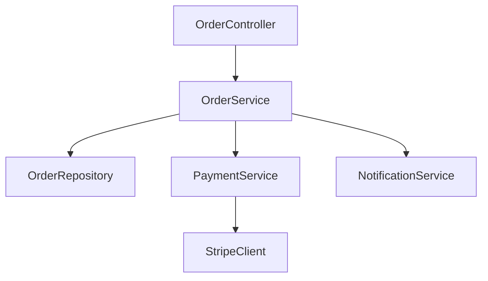
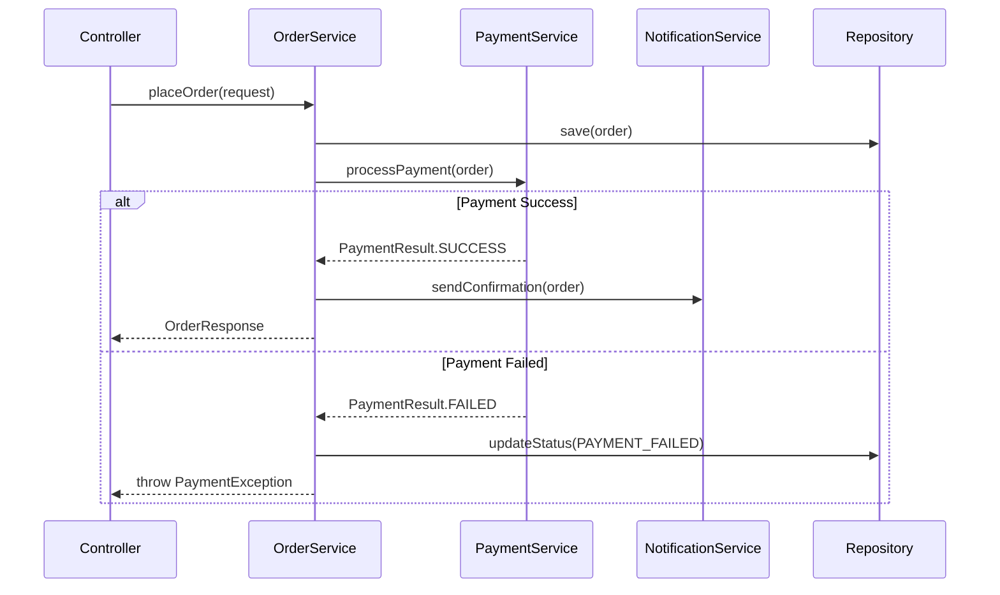

# Analyzing Service Layer

## Overview

Analysis of business logic, application services, use cases, and data transformation. Covers both the orchestration layer and transformation logic (DTOs, mappers).

**Output:** `docs/unwind/layers/service-layer.md`
**Depends on:** Domain model analysis

## Focus Areas

### 1. Service Categories

**Application Services:**
- Use case orchestration
- Transaction boundaries
- Input/output transformation

**Domain Services:**
- Business logic not belonging to entities
- Cross-entity operations
- Domain calculations

**Infrastructure Services:**
- External integrations
- Third-party API clients
- Email, notifications, etc.

### 2. Transaction Management

**Boundaries:**
- Where transactions start/end
- Propagation settings
- Isolation levels

**Patterns:**
- Transaction per request
- Transaction per use case
- Saga patterns

### 3. Business Workflows

**Multi-Step Processes:**
- Order fulfillment
- User registration
- Payment processing

**State Machines:**
- Workflow states
- Transition logic
- Error handling

### 4. Data Transformation

**DTOs (Data Transfer Objects):**
- Request DTOs (input)
- Response DTOs (output)
- Internal DTOs

**Mappers:**
- Entity ↔ DTO mapping
- Manual vs framework (MapStruct, AutoMapper)
- Mapping edge cases

### 5. External Integrations

**Third-Party Services:**
- Payment gateways
- Email providers
- External APIs

**Integration Patterns:**
- Adapters
- Anti-corruption layers
- Circuit breakers

## The Process

### Step 1: Locate Service Artifacts

Search for:
```
# Service classes
**/service/**/*
**/services/**/*
**/usecase/**/*
**/application/**/*

# DTOs and mappers
**/dto/**/*
**/mapper/**/*
**/converter/**/*
**/transformer/**/*

# Integration
**/client/**/*
**/integration/**/*
**/adapter/**/*
```

### Step 2: Catalog Services

For each service:
1. Identify the class
2. Document public methods (use cases)
3. Note dependencies
4. Map transaction boundaries
5. Identify business rules

### Step 3: Analyze Transformations

Document:
1. Request/Response DTOs
2. Entity-DTO mappings
3. Mapping conventions
4. Edge case handling

### Step 4: Map Dependencies

Create dependency graph:
- Service → Service dependencies
- Service → Repository dependencies
- Service → External client dependencies

### Step 5: Document Workflows

For complex processes:
1. Identify entry point
2. Trace through services
3. Document decision points
4. Note error handling

## Output Format

```markdown
# Service Layer Analysis

> **Analyzed by:** unwind:analyzing-service-layer
> **Generated:** [ISO timestamp]
> **Confidence:** High | Medium | Low

## Summary

[2-3 sentences: service architecture style, key patterns]

## Service Architecture

### Service Categories

| Category | Count | Examples |
|----------|-------|----------|
| Application Services | 12 | UserService, OrderService |
| Domain Services | 4 | PricingService, TaxCalculator |
| Infrastructure Services | 6 | EmailService, PaymentClient |

### Dependency Graph



## Application Services

### UserService

**Purpose:** User account management

**Dependencies:**
- UserRepository
- EmailService
- PasswordEncoder

**Use Cases:**

| Method | Transaction | Description |
|--------|-------------|-------------|
| createUser() | Required | User registration |
| updateProfile() | Required | Profile updates |
| deactivate() | Required | Account deactivation |

**Key Method Analysis:**

```java
// UserService.java:45
@Transactional
public UserResponse createUser(CreateUserRequest request) {
    // 1. Validate email uniqueness
    // 2. Create user entity
    // 3. Save to repository
    // 4. Send welcome email
    // 5. Return response DTO
}
```

**Business Rules:**
- Email must be unique
- Password requirements enforced
- Welcome email sent on creation

[Repeat for key services...]

## Domain Services

### PricingService

**Purpose:** Calculate prices with discounts and taxes

**Logic:**
```java
public Money calculateTotal(Order order) {
    Money subtotal = order.getItems().stream()
        .map(OrderItem::getPrice)
        .reduce(Money.ZERO, Money::add);
    Money discount = discountService.calculate(order);
    Money tax = taxService.calculate(subtotal.subtract(discount));
    return subtotal.subtract(discount).add(tax);
}
```

## Data Transformation

### DTO Overview

| DTO | Direction | Entity | Usage |
|-----|-----------|--------|-------|
| CreateUserRequest | Input | User | Registration |
| UserResponse | Output | User | All responses |
| OrderSummaryDto | Output | Order | List views |

### Request DTOs

**CreateUserRequest:**
```java
public class CreateUserRequest {
    @NotBlank
    @Email
    private String email;

    @NotBlank
    @Size(min = 8)
    private String password;

    @NotBlank
    private String name;
}
```

### Response DTOs

**UserResponse:**
```java
public class UserResponse {
    private Long id;
    private String email;
    private String name;
    private UserStatus status;
    private LocalDateTime createdAt;
    // Note: password excluded
}
```

### Mapping Strategy

**Framework:** MapStruct / Manual / AutoMapper

**Mapper Example:**
```java
@Mapper
public interface UserMapper {
    UserResponse toResponse(User user);
    User toEntity(CreateUserRequest request);
}
```

**Edge Cases:**
- Null handling: [strategy]
- Nested objects: [strategy]
- Collections: [strategy]

## Transaction Management

### Boundaries

| Service Method | Propagation | Isolation |
|----------------|-------------|-----------|
| createUser() | REQUIRED | DEFAULT |
| processPayment() | REQUIRES_NEW | SERIALIZABLE |
| batchUpdate() | REQUIRED | READ_COMMITTED |

### Patterns Observed

- Transaction per use case (standard)
- REQUIRES_NEW for payment operations
- No distributed transactions (single DB)

## Business Workflows

### Order Placement Flow



## External Integrations

### Payment Gateway (Stripe)

**Client:** StripePaymentClient
**Pattern:** Adapter with retry

```java
@Service
public class StripePaymentClient {
    @Retryable(maxAttempts = 3)
    public PaymentResult charge(Money amount, String token) {
        // Stripe API call
    }
}
```

### Email Service (SendGrid)

**Client:** SendGridEmailClient
**Pattern:** Async with queue

## Cross-Cutting Touchpoints

@cross-cutting:authentication
- Services use `@PreAuthorize` for method security
- `SecurityContextHolder` accessed in 8 services
- User context passed through services

@cross-cutting:validation
- Request DTOs use Bean Validation
- Custom validators for business rules
- Validation in service layer for complex rules

@cross-cutting:error-handling
- Services throw domain exceptions
- Global exception handler in API layer
- Error codes in exceptions

@cross-cutting:logging
- Entry/exit logging on public methods
- Structured logging with context
- Sensitive data masking in logs

## Patterns Observed

### Pattern: Command/Query Separation
- Command methods (create, update, delete) return void or ID
- Query methods return DTOs

### Pattern: Service Facade
- `OrderFacade` aggregates multiple services

### Anti-Pattern: Service Bloat
- `UserService` has 25+ methods - consider splitting

## Unknowns and Questions

- [ ] `LegacyOrderService` - still in use?
- [ ] `@Deprecated` methods - removal timeline?

## Recommendations

1. **Split large services** - UserService too large
2. **Add circuit breaker** - External calls lack fault tolerance
3. **Standardize DTO naming** - Mix of conventions
4. **Document workflows** - Complex flows undocumented
```

## Refresh Mode

If previous analysis exists:
1. Load existing service layer doc
2. Detect changes (new services, modified methods)
3. Add `## Changes Since Last Review`
4. Flag new services, changed transactions, new integrations
