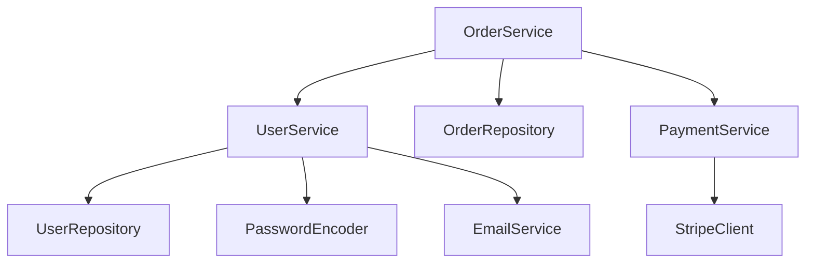

# Analyzing Service Layer

**Output:** `docs/unwind/layers/service-layer/` (folder with index.md + section files)

**Principles:** See `analysis-principles.md` - completeness, machine-readable, link to source, no commentary, incremental writes.

## Output Structure

```
docs/unwind/layers/service-layer/
├── index.md           # Overview, service count, dependency graph
├── services.md        # Service class definitions
├── dtos.md            # Data transfer objects
├── mappers.md         # Mapping logic
├── formulas.md        # Business calculations [MUST]
└── clients.md         # External client integrations
```

For large codebases (20+ services), split by domain:
```
docs/unwind/layers/service-layer/
├── index.md
├── users-domain.md
├── orders-domain.md
└── ...
```

## Process (Incremental Writes)

**Step 1: Setup**
```bash
mkdir -p docs/unwind/layers/service-layer/
```
Write initial `index.md`:
```markdown
# Service Layer

## Sections
- [Services](services.md) - _pending_
- [DTOs](dtos.md) - _pending_
- [Mappers](mappers.md) - _pending_
- [Formulas](formulas.md) - _pending_
- [External Clients](clients.md) - _pending_

## Summary
_Analysis in progress..._
```

**Step 2: Analyze and write services.md**
1. Find all service classes
2. Include method signatures, transaction boundaries
3. Write `services.md` immediately
4. Update `index.md`

**Step 3: Analyze and write dtos.md**
1. Find all DTOs (request/response)
2. Include validation annotations
3. Write `dtos.md` immediately
4. Update `index.md`

**Step 4: Analyze and write mappers.md**
1. Find all mappers
2. Write `mappers.md` immediately
3. Update `index.md`

**Step 5: Analyze and write formulas.md**
1. Extract ALL business calculations [MUST]
2. Document constants, edge cases
3. Write `formulas.md` immediately
4. Update `index.md`

**Step 6: Analyze and write clients.md** (if applicable)
1. Find external client integrations
2. Write `clients.md` immediately
3. Update `index.md`

**Step 7: Finalize index.md**
Add dependency graph and final counts

## Output Format

```markdown
# Service Layer

## Services

### UserService

[UserService.java](https://github.com/owner/repo/blob/main/src/service/UserService.java)

```java
@Service
@RequiredArgsConstructor
public class UserService {
    private final UserRepository userRepository;
    private final PasswordEncoder passwordEncoder;
    private final EmailService emailService;

    @Transactional
    public User createUser(CreateUserRequest request) {
        if (userRepository.existsByEmail(request.email())) {
            throw new DuplicateEmailException(request.email());
        }
        User user = new User(request.email(), passwordEncoder.encode(request.password()));
        user = userRepository.save(user);
        emailService.sendWelcome(user);
        return user;
    }

    @Transactional(readOnly = true)
    public User getUser(Long id) {
        return userRepository.findById(id)
            .orElseThrow(() -> new UserNotFoundException(id));
    }
}
```

[Continue for ALL services...]

## DTOs

### CreateUserRequest

[CreateUserRequest.java](https://github.com/owner/repo/blob/main/src/dto/CreateUserRequest.java)

```java
public record CreateUserRequest(
    @NotBlank @Email String email,
    @NotBlank @Size(min = 8) String password,
    @NotBlank String name
) {}
```

### UserResponse

```java
public record UserResponse(
    Long id,
    String email,
    String name,
    UserStatus status,
    Instant createdAt
) {}
```

[Continue for ALL DTOs...]

## Mappers

### UserMapper

[UserMapper.java](https://github.com/owner/repo/blob/main/src/mapper/UserMapper.java)

```java
@Mapper(componentModel = "spring")
public interface UserMapper {
    UserResponse toResponse(User user);

    @Mapping(target = "id", ignore = true)
    @Mapping(target = "status", constant = "ACTIVE")
    User toEntity(CreateUserRequest request);
}
```

## External Clients

### StripeClient

[StripeClient.java](https://github.com/owner/repo/blob/main/src/client/StripeClient.java)

```java
@Component
public class StripeClient {
    @Retryable(maxAttempts = 3, backoff = @Backoff(delay = 1000))
    public PaymentResult charge(String token, Money amount) {
        // Stripe API call
    }
}
```

## Service Dependencies



## Unknowns

- [List anything unclear]
```

## Additional Requirements

### Formula Documentation [MUST]

For every calculation or business formula:

1. **Document with exact source reference:**
```markdown
### Cost Calculation [MUST]

**Source:** `snapshot-operations.ts:186`

```typescript
total = periods[rate.interval] * rate.rate * fteBasis * allocation * holidayPercentage
```
```

2. **Document ALL edge cases and conditional logic:**
```markdown
### Rate Interval Edge Cases [MUST]

| Interval | Formula | Note |
|----------|---------|------|
| hours | workingDays * 8 * rate * fte * allocation | 8 hours/day hardcoded |
| days | workingDays * rate * fte * allocation | Standard |
| weeks | ceil(workingDays/5) * rate * fte * allocation | Rounds up |
| months | rate * fte * allocation | **NO period multiplier** |
| years | (workingDays/365) * rate * fte * allocation | Prorated |
```

3. **Document hardcoded constants:**
```markdown
### Constants [MUST]

| Constant | Value | Location |
|----------|-------|----------|
| hoursPerDay | 8 | builder.ts:185 |
| daysInYear | 365 | builder.ts:208 |
```

### Fallback/Resolution Logic [MUST]

Document any fallback chains or resolution hierarchies:
```markdown
### Rate Resolution Chain [MUST]

1. **Primary:** supplier + employmentType + roleLevel + calendar + branch
2. **Fallback:** supplier + calendar + branch (null employmentType/roleLevel)
3. **Missing:** Logged to missingRates array, uses 0
```

### Transaction Boundaries [SHOULD]

Note where transactions begin/end and any batch processing patterns.

## Refresh Mode

If `docs/unwind/layers/service-layer/` exists, compare current state and add `## Changes Since Last Review` section to `index.md`.
