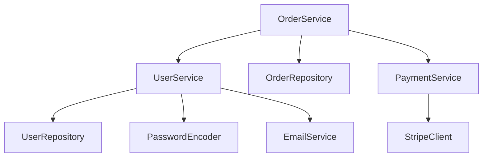

# Analyzing Service Layer

**Output:** `docs/unwind/layers/service-layer.md` (or `service-layer/` directory if large)

**Principles:** See `analysis-principles.md` - completeness, machine-readable, link to source, no commentary.

## Process

1. **Find all service artifacts:**
   - Service classes
   - DTOs (request/response)
   - Mappers
   - External clients

2. **Document ALL services:**
   - Include actual method signatures
   - Show transaction boundaries
   - Link to source files

3. **Document ALL DTOs:**
   - Include actual class definitions
   - Show validation annotations

4. **If large:** Split by domain into `layers/service-layer/{domain}.md`

## Output Format

```markdown
# Service Layer

## Services

### UserService

[UserService.java](https://github.com/owner/repo/blob/main/src/service/UserService.java)

```java
@Service
@RequiredArgsConstructor
public class UserService {
    private final UserRepository userRepository;
    private final PasswordEncoder passwordEncoder;
    private final EmailService emailService;

    @Transactional
    public User createUser(CreateUserRequest request) {
        if (userRepository.existsByEmail(request.email())) {
            throw new DuplicateEmailException(request.email());
        }
        User user = new User(request.email(), passwordEncoder.encode(request.password()));
        user = userRepository.save(user);
        emailService.sendWelcome(user);
        return user;
    }

    @Transactional(readOnly = true)
    public User getUser(Long id) {
        return userRepository.findById(id)
            .orElseThrow(() -> new UserNotFoundException(id));
    }
}
```

[Continue for ALL services...]

## DTOs

### CreateUserRequest

[CreateUserRequest.java](https://github.com/owner/repo/blob/main/src/dto/CreateUserRequest.java)

```java
public record CreateUserRequest(
    @NotBlank @Email String email,
    @NotBlank @Size(min = 8) String password,
    @NotBlank String name
) {}
```

### UserResponse

```java
public record UserResponse(
    Long id,
    String email,
    String name,
    UserStatus status,
    Instant createdAt
) {}
```

[Continue for ALL DTOs...]

## Mappers

### UserMapper

[UserMapper.java](https://github.com/owner/repo/blob/main/src/mapper/UserMapper.java)

```java
@Mapper(componentModel = "spring")
public interface UserMapper {
    UserResponse toResponse(User user);

    @Mapping(target = "id", ignore = true)
    @Mapping(target = "status", constant = "ACTIVE")
    User toEntity(CreateUserRequest request);
}
```

## External Clients

### StripeClient

[StripeClient.java](https://github.com/owner/repo/blob/main/src/client/StripeClient.java)

```java
@Component
public class StripeClient {
    @Retryable(maxAttempts = 3, backoff = @Backoff(delay = 1000))
    public PaymentResult charge(String token, Money amount) {
        // Stripe API call
    }
}
```

## Service Dependencies



## Unknowns

- [List anything unclear]
```

## Refresh Mode

If `service-layer.md` exists, compare and add `## Changes Since Last Review` section.
