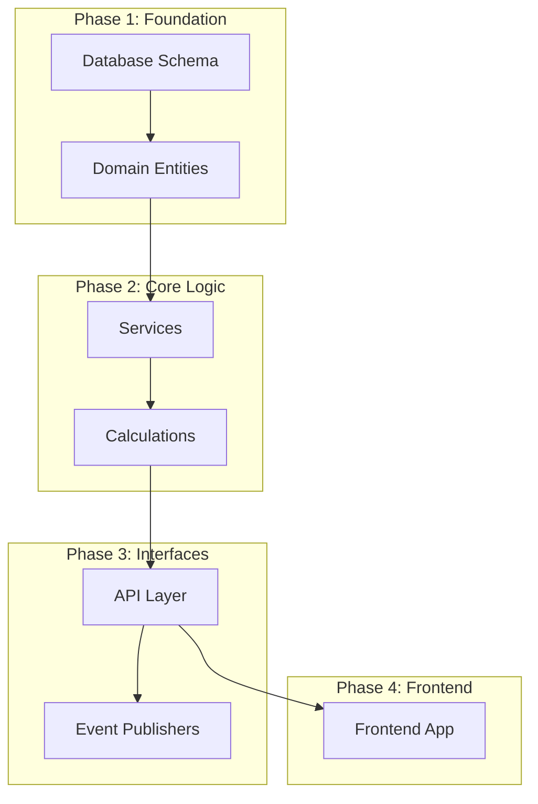

# Synthesizing Findings → Rebuild Plan

## Overview

Transform all layer analysis documents into:
1. **CODEBASE.md** - Unified documentation for understanding
2. **REBUILD-PLAN.md** - Phased migration/rebuild strategy with validation checkpoints

**Requires:** `docs/unwind/layers/*.md` from layer specialists + verification reports
**Produces:**
- `docs/unwind/CODEBASE.md` - Reference documentation
- `docs/unwind/REBUILD-PLAN.md` - Actionable rebuild strategy

## Prerequisites

Before using this skill:
1. All detected layers have been analyzed
2. Verification pass has completed
3. Layer docs exist in `docs/unwind/layers/`

## The Process

### Step 1: Inventory and Score

Read all docs from `docs/unwind/layers/`:
- Layer analysis files (`*.md`)
- Verification reports (`*-verification.md`)

Extract:
- Rebuild readiness scores per layer
- MUST/SHOULD/DON'T categorizations
- External contracts (OpenAPI, AsyncAPI, etc.)

### Step 2: Identify External Contracts [CRITICAL]

These define what MUST be preserved exactly:

```markdown
## External Contracts [MUST PRESERVE EXACTLY]

| Contract Type | Location | Consumers |
|---------------|----------|-----------|
| OpenAPI 3.0 | docs/openapi.yaml | Mobile app, Partner integrations |
| AsyncAPI | docs/asyncapi.yaml | Event subscribers |
| TSRest | src/contracts/api.ts | Frontend client |
```

**Validation:** Any rebuild MUST pass contract compatibility tests against these specs.

### Step 3: Build Dependency Graph for Rebuild

Determine the order components must be rebuilt:



### Step 4: Generate Rebuild Phases

For each phase, define:
- What to build
- Prerequisites
- Validation criteria
- Rollback strategy

### Step 5: Define Validation Checkpoints

Each phase must have concrete validation:

| Phase | Validation | Pass Criteria |
|-------|------------|---------------|
| Database | Schema diff | 0 differences from original DDL |
| Services | Unit tests | All MUST calculations match original |
| API | Contract tests | OpenAPI spec passes 100% |
| Integration | E2E tests | Core user flows work |

### Step 6: Generate REBUILD-PLAN.md

Write actionable rebuild plan to `docs/unwind/REBUILD-PLAN.md`.

---

## Output Format: REBUILD-PLAN.md

```markdown
# [Project Name] - Rebuild Plan

> Generated by Unwind on [timestamp]
> Target: Rebuild in [target language/framework]

## Executive Summary

**Original Stack:** [e.g., TypeScript/React/Hono/PostgreSQL]
**Rebuild Readiness:** [X/10 average across layers]
**Estimated Phases:** [N phases]
**Critical Contracts:** [List external APIs that must be preserved]

## External Contract Compatibility [CRITICAL]

These specifications define external interfaces that MUST be maintained exactly:

### API Contract
**File:** `docs/openapi.yaml`
**Validation:** Run OpenAPI diff tool against rebuilt API
```bash
# Validation command
openapi-diff original.yaml rebuilt.yaml --fail-on-incompatible
```

### Event Contract
**File:** `docs/asyncapi.yaml`
**Validation:** Schema compatibility check
```bash
asyncapi diff original.yaml rebuilt.yaml
```

---

## Phase 1: Database & Domain Foundation

**Duration Estimate:** [Do not include - user decides timing]
**Prerequisites:** None
**Rebuild Readiness:** [X/10]

### What to Build

#### 1.1 Database Schema [MUST]

Recreate all [N] tables with exact structure:

| Table | Columns | Constraints | Priority |
|-------|---------|-------------|----------|
| users | 12 | PK, 3 FK, 2 UNIQUE | MUST |
| orders | 8 | PK, 2 FK | MUST |
| ... | ... | ... | ... |

**Source:** `docs/unwind/layers/database.md`

**Key Constraints to Preserve:**
- Multi-tenancy: All tables have `organisation` FK
- Soft delete: `active` boolean on entity tables
- Audit: `created_at`, `updated_at` timestamps

#### 1.2 Domain Entities [MUST]

| Entity | Fields | Validation Rules | State Machine |
|--------|--------|------------------|---------------|
| User | 12 | Email format, password min 8 | active → suspended → deleted |
| Budget | 8 | Status enum | draft → published |
| ... | ... | ... | ... |

**Source:** `docs/unwind/layers/domain-model.md`

### Validation Checkpoint 1

```markdown
## Phase 1 Validation Checklist

[ ] Schema created with all [N] tables
[ ] All foreign keys match original
[ ] All indexes created
[ ] All constraints enforced
[ ] JSONB column structures match
[ ] Sample data can be inserted
[ ] Basic CRUD operations work

**Validation Script:**
```sql
-- Compare table counts
SELECT COUNT(*) FROM information_schema.tables WHERE table_schema = 'public';
-- Should equal: [N]

-- Compare column counts per table
SELECT table_name, COUNT(*) as column_count
FROM information_schema.columns
WHERE table_schema = 'public'
GROUP BY table_name;
```
```

---

## Phase 2: Business Logic & Calculations

**Prerequisites:** Phase 1 complete
**Rebuild Readiness:** [X/10]

### What to Build

#### 2.1 Core Calculations [MUST]

These formulas MUST produce identical results:

##### Cost Calculation
```
cost = periods[rate.interval] × rate × fteBasis × allocation × holidayPercentage
```

**Edge Cases:**
| Interval | Formula | Note |
|----------|---------|------|
| hours | workingDays × 8 × rate × fte × allocation | hoursPerDay = 8 |
| days | workingDays × rate × fte × allocation | Standard |
| months | rate × fte × allocation | NO period multiplier |

**Source:** `docs/unwind/layers/service-layer.md`

##### Constants to Preserve
| Constant | Value | Usage |
|----------|-------|-------|
| hoursPerDay | 8 | Hour calculations |
| daysInYear | 365 | Year proration |

#### 2.2 Service Functions [MUST]

| Service | Key Methods | Dependencies |
|---------|-------------|--------------|
| BudgetBuilder | build(), aggregate() | RateService, PeriodService |
| SnapshotService | create(), compare() | CalculationService |
| ... | ... | ... |

### Validation Checkpoint 2

```markdown
## Phase 2 Validation Checklist

[ ] All calculation formulas implemented
[ ] Edge cases handled (monthly rates, etc.)
[ ] Constants match original values
[ ] Unit tests pass for:
    [ ] Cost calculation with all interval types
    [ ] Rate resolution fallback chain
    [ ] CAPEX/OPEX splitting
    [ ] Holiday percentage by calendar type

**Calculation Verification:**
```typescript
// Test vectors from original system
const testCases = [
  { input: {...}, expected: 1234.56 },
  { input: {...}, expected: 789.00 },
];

testCases.forEach(tc => {
  const result = calculateCost(tc.input);
  assert(result === tc.expected, `Expected ${tc.expected}, got ${result}`);
});
```
```

---

## Phase 3: API Layer

**Prerequisites:** Phase 2 complete
**Rebuild Readiness:** [X/10]

### What to Build

#### 3.1 Endpoints [MUST - EXTERNAL CONTRACT]

Implement all [N] endpoints matching OpenAPI spec exactly:

| Method | Path | Auth | Handler |
|--------|------|------|---------|
| POST | /api/v1/users | None | createUser |
| GET | /api/v1/users/:id | User | getUser |
| ... | ... | ... | ... |

**Full endpoint inventory:** `docs/unwind/layers/api.md`

#### 3.2 Authentication [MUST]

Preserve authentication flow exactly:
1. OAuth providers: [GitHub, Google, GitLab]
2. Session management: [Cookie-based, JWT]
3. Permission model: [CASL rules]

#### 3.3 Error Responses [MUST]

| Error Code | HTTP Status | Response Shape |
|------------|-------------|----------------|
| USER_NOT_FOUND | 404 | `{ error: string, code: string }` |
| VALIDATION_ERROR | 400 | `{ errors: FieldError[] }` |

### Validation Checkpoint 3

```markdown
## Phase 3 Validation Checklist

[ ] All [N] endpoints implemented
[ ] OpenAPI contract validation passes
[ ] Authentication flows work:
    [ ] OAuth login
    [ ] Session creation
    [ ] Token refresh
[ ] Permission checks enforced
[ ] Error responses match contract

**Contract Validation:**
```bash
# Run OpenAPI compatibility check
npx @apidevtools/swagger-cli validate rebuilt-api.yaml
npx openapi-diff original.yaml rebuilt.yaml --fail-on-incompatible

# Run API integration tests
npm run test:api
```
```

---

## Phase 4: Frontend (if applicable)

**Prerequisites:** Phase 3 complete
**Rebuild Readiness:** [X/10]

### What to Build

Focus on FUNCTIONALITY, not implementation:

#### 4.1 User Flows [MUST]

| Flow | Steps | Validation |
|------|-------|------------|
| User Registration | Form → API → Redirect | User appears in DB |
| Budget Creation | Select calendar → Add positions → Publish | Budget calculations match |
| ... | ... | ... |

#### 4.2 State Requirements [MUST]

| State | Persistence | Purpose |
|-------|-------------|---------|
| Auth token | LocalStorage | Session |
| Selected org | LocalStorage | Multi-tenancy |
| Theme | LocalStorage | Preference |

### Validation Checkpoint 4

```markdown
## Phase 4 Validation Checklist

[ ] All user flows functional
[ ] State persists correctly across refresh
[ ] Permission-based UI hiding works
[ ] API integration works for all endpoints

**E2E Validation:**
```bash
# Run E2E test suite
npx playwright test

# Core flows to verify manually:
1. User can log in via OAuth
2. User can create and publish budget
3. User can view snapshot comparison
4. Admin can manage users
```
```

---

## Phase 5: Integration & Migration

**Prerequisites:** Phases 1-4 complete

### 5.1 Data Migration

```markdown
## Migration Strategy

1. **Schema Migration**
   - Create new schema
   - Run DDL from Phase 1
   - Verify structure matches

2. **Data Migration**
   - Export from original: `pg_dump --data-only`
   - Transform if needed (rare - schema should match)
   - Import to new system

3. **Verification**
   - Row counts match
   - Checksums match for critical tables
   - Sample queries return same results
```

### 5.2 Parallel Running

```markdown
## Parallel Validation Strategy

1. Run original and rebuilt systems simultaneously
2. Mirror traffic to both (read-only on rebuilt)
3. Compare responses for divergence
4. Investigate and fix any differences
5. Gradually shift traffic when confidence is high
```

### Final Validation

```markdown
## Go-Live Checklist

[ ] All phase validation checkpoints pass
[ ] Data migration verified
[ ] Performance acceptable
[ ] External contracts validated
[ ] Rollback plan tested
[ ] Monitoring in place
```

---

## Appendix: Layer Documentation

- [Database Layer](layers/database.md) - Readiness: X/10
- [Domain Model](layers/domain-model.md) - Readiness: X/10
- [Service Layer](layers/service-layer.md) - Readiness: X/10
- [API Layer](layers/api.md) - Readiness: X/10
- [Frontend Layer](layers/frontend.md) - Readiness: X/10

## Appendix: Verification Reports

- [Database Verification](layers/database-verification.md)
- [Service Verification](layers/service-layer-verification.md)
- [API Verification](layers/api-verification.md)
- [Domain Verification](layers/domain-model-verification.md)
- [Frontend Verification](layers/frontend-verification.md)
```

---

## Also Generate: CODEBASE.md

In addition to REBUILD-PLAN.md, generate a reference CODEBASE.md that contains:

1. **Executive Summary** - What the system does
2. **Architecture Overview** - Layers and dependencies
3. **Cross-Cutting Concerns** - Auth, logging, error handling
4. **Data Flows** - Key user journeys traced through system
5. **Glossary** - Domain terminology
6. **Quick Reference** - Key files and commands

This serves as the "understanding" document, while REBUILD-PLAN.md is the "action" document.

---

## Refresh Mode

If rebuild plan exists:
1. Read existing plan
2. Compare to new analysis
3. Add `## Changes Since Last Plan` section
4. Update readiness scores
5. Flag any new external contracts discovered

## After Completion

Announce:
> Rebuild plan complete. See:
> - `docs/unwind/REBUILD-PLAN.md` - Phased rebuild strategy with validation checkpoints
> - `docs/unwind/CODEBASE.md` - Reference documentation
>
> Start with Phase 1 (Database & Domain) and validate each phase before proceeding.
