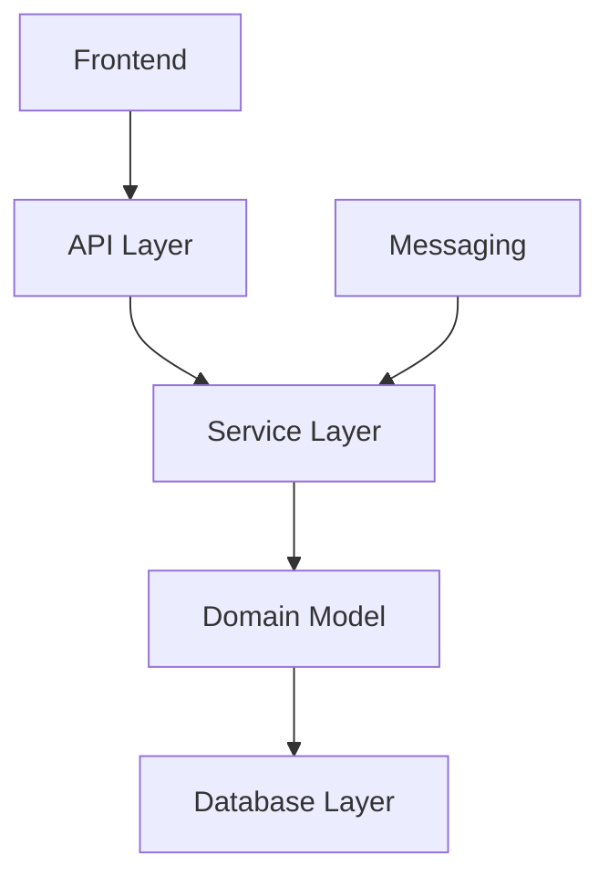
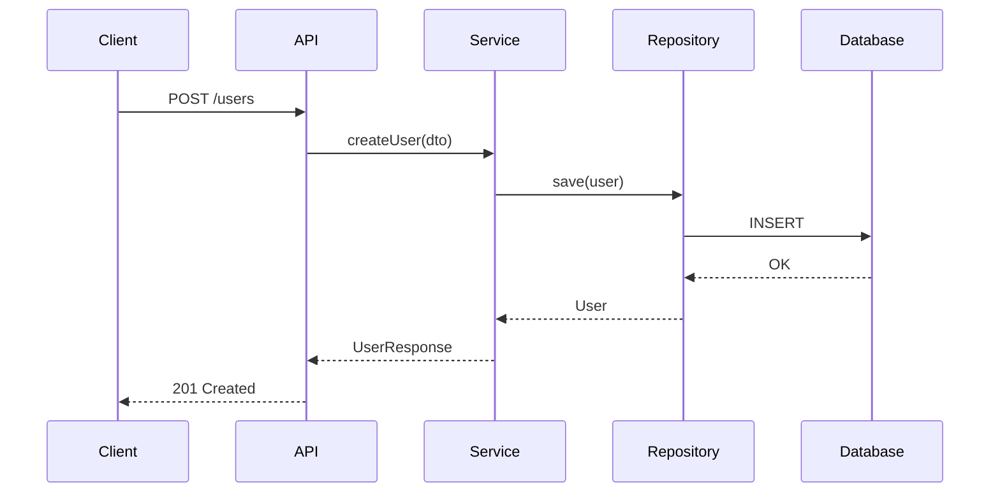

# Synthesizing Findings

## Overview

Combine all layer analysis documents into a coherent, unified codebase documentation. Resolves cross-references, builds complete data flow diagrams, and produces the final CODEBASE.md.

**Requires:** `docs/unwind/layers/*.md` from layer specialists
**Produces:** `docs/unwind/CODEBASE.md`

## Prerequisites

Before using this skill:
1. All detected layers have been analyzed
2. Layer docs exist in `docs/unwind/layers/`
3. Run `unwind:unwinding-codebase` first

## The Process

### Step 1: Inventory Layer Documents

Read all docs from `docs/unwind/layers/`:
- `database.md`
- `domain-model.md`
- `service-layer.md`
- `api.md`
- `messaging.md` (if exists)
- `frontend.md` (if exists)

Verify expected layers from `architecture.md` are present.

### Step 2: Extract Cross-Cutting Concerns

Search all layer docs for `@cross-cutting:` markers:

```
@cross-cutting:authentication
@cross-cutting:logging
@cross-cutting:error-handling
@cross-cutting:caching
@cross-cutting:validation
```

Group findings by concern type.

### Step 3: Build Unified Cross-Cutting Sections

For each cross-cutting concern:
1. Collect all marked sections from layer docs
2. Trace the concern across layers
3. Document the complete picture
4. Identify gaps or inconsistencies

### Step 4: Trace End-to-End Data Flows

For key use cases, trace request flow:

```
API Request → Controller → Service → Repository → Database
                ↓
           Domain Model
                ↓
            Response DTO
```

Document 3-5 representative flows showing how data moves through the system.

### Step 5: Build Dependency Graph

Create a visual dependency map:



### Step 6: Identify Patterns and Conventions

Synthesize common patterns observed across layers:
- Naming conventions
- Error handling patterns
- Validation approaches
- Testing patterns

### Step 7: Compile Technical Debt

Aggregate issues and recommendations from all layer docs:
- Critical issues (must fix)
- Important issues (should fix)
- Suggestions (nice to have)

### Step 8: Generate CODEBASE.md

Write the final document to `docs/unwind/CODEBASE.md`.

## Output Format

```markdown
# [Project Name] - Codebase Documentation

> Generated by Unwind on [timestamp]
> Last updated: [timestamp]

## Executive Summary

[2-3 paragraph overview of the codebase: what it does, key technologies, architectural style]

## Architecture Overview

### Technology Stack

| Category | Technology |
|----------|------------|
| Language | [e.g., Java 17] |
| Framework | [e.g., Spring Boot 3.x] |
| Database | [e.g., PostgreSQL 14] |
| ORM | [e.g., Hibernate/JPA] |
| Build | [e.g., Gradle] |

### Layer Summary

| Layer | Status | Components | Key Patterns |
|-------|--------|------------|--------------|
| Database | Analyzed | 15 tables, 12 repositories | Repository pattern |
| Domain | Analyzed | 20 entities, 8 value objects | Rich domain model |
| Service | Analyzed | 18 services | Transaction per use case |
| API | Analyzed | 45 endpoints | RESTful, OpenAPI |
| Messaging | Not Present | - | - |
| Frontend | Analyzed | React SPA | Component-based |

### Dependency Graph

```mermaid
[dependency diagram]
```

---

## Layer Details

### Database Layer
[Summary from database.md]
[Link to full analysis: layers/database.md]

### Domain Model
[Summary from domain-model.md]
[Link to full analysis: layers/domain-model.md]

[Continue for each layer...]

---

## Cross-Cutting Concerns

### Authentication & Authorization

[Unified view combining findings from all layers]

**Flow:**
1. JWT token in Authorization header
2. Filter validates token (API layer)
3. SecurityContext populated (Service layer)
4. @PreAuthorize checks (Service layer)

### Error Handling

[Unified error handling documentation]

### Logging

[Unified logging documentation]

---

## Data Flows

### Example: User Registration



[Document 3-5 key flows]

---

## Patterns & Conventions

### Naming Conventions
- [Pattern observations]

### Code Organization
- [Structural patterns]

### Testing Approach
- [Testing patterns observed]

---

## Technical Debt & Recommendations

### Critical (Must Fix)
1. [Issue from layer analysis]
2. [Issue]

### Important (Should Fix)
1. [Issue]
2. [Issue]

### Suggestions
1. [Nice to have]

---

## Glossary

| Term | Definition |
|------|------------|
| [Domain term] | [Definition] |

---

## Quick Reference

### Key Files

| Purpose | Location |
|---------|----------|
| Main entry point | src/main/java/.../Application.java |
| Database config | src/main/resources/application.yml |
| API routes | src/main/java/.../controller/ |

### Common Commands

```bash
# Build
./gradlew build

# Run tests
./gradlew test

# Start application
./gradlew bootRun
```

---

## Appendix: Full Layer Analyses

- [Database Layer](layers/database.md)
- [Domain Model](layers/domain-model.md)
- [Service Layer](layers/service-layer.md)
- [API Layer](layers/api.md)
- [Messaging Layer](layers/messaging.md) (if present)
- [Frontend Layer](layers/frontend.md) (if present)
```

## Refresh Mode

If `CODEBASE.md` already exists:

1. Read existing document
2. Compare to new synthesis
3. Add `## Changes Since Last Synthesis` section at top
4. Highlight:
   - New components discovered
   - Removed components
   - Changed patterns
   - Updated technical debt

## After Completion

Announce:
> Codebase documentation complete. See `docs/unwind/CODEBASE.md` for the full analysis.
>
> Individual layer analyses available in `docs/unwind/layers/`.
